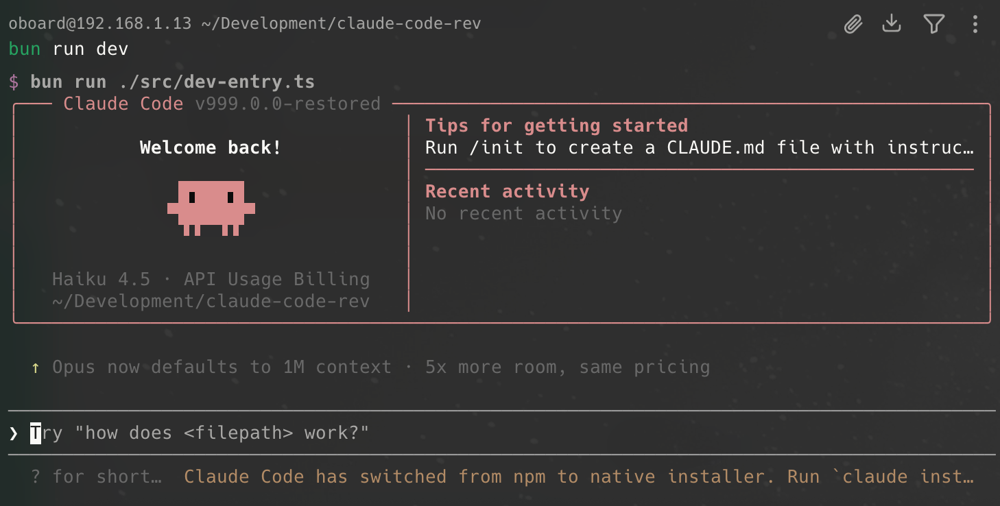

# mycli



`mycli` 是 Claude Code 的一个分支：最初通过 source map 逆向还原并补齐缺失模块，得到一份 Claude Code 源码树，现在以 `mycli` 的身份独立维护。

它并不是上游仓库的原始状态。部分文件无法仅凭 source map 恢复，因此目前仍包含兼容 shim 或降级实现，以便项目可以重新安装并运行。

## 当前状态

- 该源码树已经可以在本地开发流程中恢复并运行
- `bun install` 可以成功执行
- `bun run version` 可以成功执行
- `bun run dev` 现在会通过还原后的真实 CLI bootstrap 启动，而不是临时的 `dev-entry`
- `bun run dev --help` 可以显示还原后的完整命令树
- 仍有部分模块保留恢复期 fallback，因此行为可能与上游 Claude Code 实现不同

## 已恢复内容

最近一轮恢复工作已经补回了最初 source-map 导入之外的几个关键部分：

- 默认 Bun 脚本现在会走真实的 CLI bootstrap 路径
- `claude-api` 和 `verify` 的 bundled skill 内容已经从占位文件恢复为可用参考文档
- Chrome MCP 和 Computer Use MCP 的兼容层现在会暴露更接近真实的工具目录，并返回结构化的降级响应，而不是空 stub
- 一些显式占位资源已经替换为可用的 planning 与 permission-classifier fallback prompt

当前剩余缺口主要集中在私有或原生集成部分，这些实现无法仅凭 source map 完整恢复，因此这些区域仍依赖 shim 或降级行为。

## 为什么会有这个仓库

source map 本身并不能包含完整的原始仓库：

- 类型专用文件经常缺失
- 构建时生成的文件可能不存在
- 私有包包装层和原生绑定可能无法恢复
- 动态导入和资源文件经常不完整

这个仓库的目标是把这些缺口补到"可用、可运行"的程度，形成一个可继续修复的恢复工作区。

## 运行方式

### 环境要求

- Bun 1.3.5 或更高版本
- Node.js 24 或更高版本

### 安装依赖

```bash
bun install
```

### 本地运行

运行恢复后的 CLI：

```bash
bun run dev
```

输出恢复后的版本号：

```bash
bun run version
```

### 全局安装

使用 `bun link` 可以将 `mycli` 命令全局安装到系统中，这样你就可以在任何目录下直接使用 `mycli` 命令，而不需要每次都输入完整路径或使用 `bun run dev`。

在项目目录下执行：

```bash
bun link
```

安装成功后，你可以在任何位置直接使用：

```bash
mycli
mycli --version
mycli --help
```

如果需要取消全局链接：

```bash
bun unlink
```

## 认证配置

auth 模块已被移除。凭证只从 `~/.mycli/settings.json` 读取 — 没有 OAuth、没有 macOS keychain、没有环境变量发现、没有交互式登录。

最小启动配置：

```json
{
  "apiKey": "sk-...",
  "baseUrl": "https://api.anthropic.com",
  "model": "claude-sonnet-4-6"
}
```

- `apiKey` — 每次请求都会作为 `Authorization: Bearer <value>` 发送
- `baseUrl` — 用于自托管代理、OpenAI 兼容网关或替代模型后端的覆盖。可选
- `model` — 默认模型 ID。可以通过 `--model` 在每个会话中覆盖

将 `baseUrl` 指向任何 OpenAI 或 Anthropic 兼容的端点（Ollama、LiteLLM、自托管代理、第三方 Claude 网关等）以使用非 Anthropic 模型。

`claude auth login` / `logout` / `setup-token` / `install-github-app` 子命令以及 `/login`、`/logout`、`/oauth-refresh` 斜杠命令已被移除。如果你之前通过 Anthropic 订阅 OAuth 流程进行身份验证，请从 [console.anthropic.com](https://console.anthropic.com/) 导出你的 API 密钥并将其放入 `~/.mycli/settings.json`。

## Provider 支持

当前恢复版 CLI 已经补上了一条初步的多 provider 路径，可以接 GitHub 侧的推理服务。

### 可用的 Provider

- `github-models`：OpenAI-compatible 的 GitHub Models 接口
- `github-copilot`：基于 GitHub Copilot 账号态的接口，当前主要支持 Copilot 托管的 Claude 模型

这两个 provider 的鉴权查找顺序都是：

- provider 专用环境变量
- `GH_TOKEN`
- `GITHUB_TOKEN`
- `gh auth token`

如果你想走"GitHub 账号登录态"而不是手填 token，可以先执行：

```bash
gh auth login
```

### 使用示例

使用 GitHub Models 跑 mycli runtime：

```bash
bun run dev --settings '{"provider":"github-models"}'
```

指定 GitHub Models 模型：

```bash
bun run dev --settings '{"provider":"github-models"}' --model "openai/gpt-4.1"
```

使用 GitHub Copilot 跑 mycli runtime：

```bash
bun run dev --settings '{"provider":"github-copilot"}'
```

### 交互式切换 Provider

现在也可以在 CLI 内通过交互式命令切换 provider：

```text
/provider
```

这个 picker 会列出当前可用 provider，把选择写入用户 settings，然后继续打开该 provider 对应的模型选择器。

常用命令：

- `/provider`：打开可视化 provider 选择器
- `/provider info`：显示当前 provider 和是否存在环境变量覆盖
- `/provider github-copilot`：直接切换到指定 provider
- `/model`：在切 provider 之后继续切模型，只显示当前 provider 支持的模型

切换到已经验证可用的 Copilot Claude 模型：

```bash
bun run dev --settings '{"provider":"github-copilot"}' --model "claude-opus-4.6"
```

当前已经验证能跑 mycli runtime 和工具循环的 Copilot 模型有：

- `claude-sonnet-4.6`
- `claude-opus-4.6`
- `claude-haiku-4.5`
- `claude-sonnet-4.5`
- `claude-opus-4.5`
- `claude-sonnet-4`

### 当前限制

- Copilot 托管的 Claude 模型已经可以走现有 mycli agent/runtime 路径
- Copilot 托管的 GPT/Grok 一类模型还没有完整接进来，因为它们主要需要走 Copilot 的 `/responses` API，而当前适配层主要还是 chat/messages 这条路径
