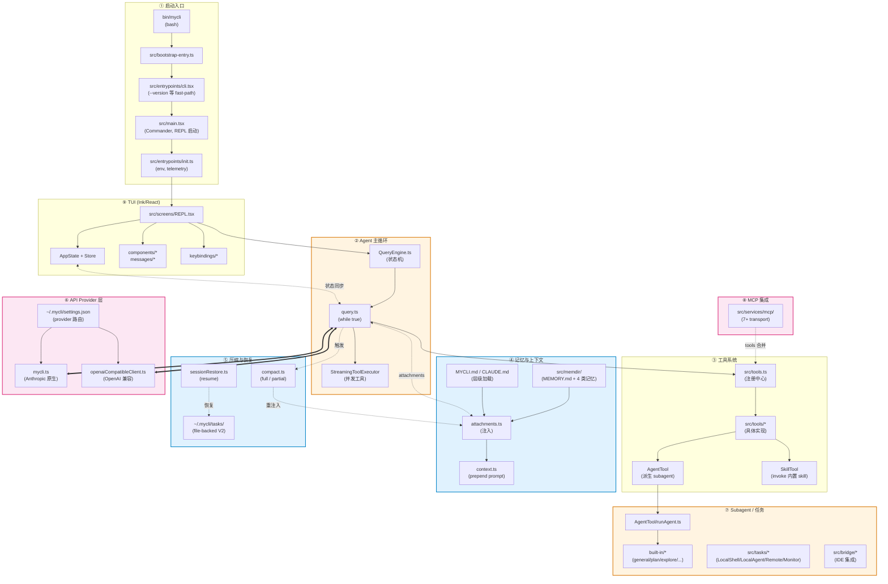

# mycli 架构与 Agent 内部机制 — 学习向技术文档

> 这套文档面向**资深工程师**，目标是让你通过阅读，理解 mycli（Claude Code 的还原 fork）项目结构、agent 怎么搭建、记忆系统怎么工作，到达"可以基于这套思路自己搭一个 coding agent"的程度。

## 关于这个项目

`mycli` 是 Claude Code 通过 source map 还原的一份源码树，被独立维护。它**不是**上游的纯净拷贝——部分模块由 shim 兜底（`shims/`、`vendor/`、`src/native-ts/`），但核心 agent loop、工具系统、记忆系统、provider 层都是真实可读的源码。从学习 agent 内部机制的角度看，这反而是一份难得的、不带商业混淆的参考实现。

**重点观察**：这个 fork 里的 auth 已被简化（只读 `~/.mycli/settings.json`，无 OAuth / keychain），多个 Anthropic 专属网络路径被中和，`provider: anthropic-compatible` 让你能把任意 Claude 兼容网关接进来跑（Kimi、aigocode、自建 LiteLLM 等）。这让"在非 Anthropic 模型上跑 Claude Code"变成现实，也让我们能直接观察"agent 框架与底层模型解耦"的实现。

## 整体架构总览

**数据流关键路径**：用户输入 → REPL（TUI）→ QueryEngine → Query loop → 装配 messages（含 attachments / memory / system prompt）→ Provider client → API 流式响应 → 解析 tool_use → StreamingToolExecutor 并发执行 → tool_result 回灌 messages → 下一轮 → 直到 `needsFollowUp === false` 终止。

## 11 份模块文档索引

| # | 文档 | 主题 | 关键特征 |
|---|---|---|---|
| 01 | [01-boot-sequence.md](01-boot-sequence.md) | 启动链路 | `sequenceDiagram` × 1，bash → bootstrap → cli → main → init 全链路 |
| 02 | [02-agent-loop.md](02-agent-loop.md) | **Agent 主循环（核心）** | `stateDiagram-v2` × 1 + `sequenceDiagram` × 1，9000+ 字 / 30+ 代码引用 |
| 03 | [03-tools-framework.md](03-tools-framework.md) | 工具系统 | `flowchart` × 1，tool_use → 执行 → 回灌全流程 |
| 04 | [04-subagents.md](04-subagents.md) | **Subagent 机制** | `flowchart` × 1，含 `'inherit'` model 解析、上下文隔离 |
| 05 | [05-memory-and-context.md](05-memory-and-context.md) | **记忆与上下文** | `flowchart` × 2，信息流向图 + memory 分类决策树 |
| 06 | [06-compaction-and-resume.md](06-compaction-and-resume.md) | 压缩与恢复 | `sequenceDiagram` × 1 + `stateDiagram-v2` × 1，6 类 attachment 重建 |
| 07 | [07-skills-and-commands.md](07-skills-and-commands.md) | Skills + slash commands | `flowchart` × 1，含 SkillTool 与 command 关系 |
| 08 | [08-api-providers.md](08-api-providers.md) | API Provider 层 | `sequenceDiagram` × 1，cache_control / 4 个 breakpoint |
| 09 | [09-mcp-integration.md](09-mcp-integration.md) | MCP 集成 | `flowchart` × 1，7+ 种 transport |
| 10 | [10-tasks-and-bridge.md](10-tasks-and-bridge.md) | 后台任务 + bridge | `sequenceDiagram` × 1，token 三段链 |
| 11 | [11-tui.md](11-tui.md) | TUI（Ink/React） | `flowchart` × 1（7 子图），AppStateProvider + ChordInterceptor |

**全套统计**：11 份文档 / 2303 行 / 197 KB / 13 张 Mermaid 图。

## 学习路线推荐

不要按文件序号 1→11 顺序读。按下面这条路线，能更快建立"agent 是怎么搭的"心智模型：

```mermaid
flowchart LR
  R[00-README<br/>本文档] --> B[01-boot-sequence<br/>3 分钟]
  B --> L[02-agent-loop<br/>**最重要，30 分钟**]
  L --> T[03-tools-framework<br/>10 分钟]
  T --> S[04-subagents<br/>15 分钟]
  S --> M[05-memory-and-context<br/>**记忆核心，20 分钟**]
  M --> C[06-compaction-and-resume<br/>15 分钟]
  C --> P[08-api-providers<br/>10 分钟]
  P --> Sk[07-skills-and-commands<br/>5 分钟]
  Sk --> Mc[09-mcp-integration<br/>10 分钟]
  Mc --> Tk[10-tasks-and-bridge<br/>5 分钟]
  Tk --> U[11-tui<br/>5 分钟]

  classDef core fill:#fff4e1,stroke:#d97706,stroke-width:2px
  class L,M core
```

**理由**：
- **02-agent-loop** 是整个系统的中枢，先理解主循环再看其他东西，所有"为什么这么设计"的疑问才有上下文
- **03 → 04** 紧接其后：知道 tool 怎么跑，自然想问"agent 自己又怎么调 agent"，subagents 文档刚好答这个
- **05 → 06** 是另一条主线：知道 agent 能跑了，想问"上下文超了怎么办"，自然过渡到记忆与压缩
- **08 放在 07 之前**：API provider 是底层基础设施，比 skills/commands 更接近 agent 本体
- **09/10/11 是周边系统**，按需查阅

如果时间紧（< 1 小时），只读这 4 份就能拿到 80% 的核心：
1. `02-agent-loop.md` — agent 怎么跑
2. `04-subagents.md` — agent 怎么派 agent
3. `05-memory-and-context.md` — agent 怎么记
4. `06-compaction-and-resume.md` — agent 怎么"忘"得优雅

## 跨文档的核心学习要点

读完整套文档应该建立的几条心智锚点：

### 1. Agent 主循环不是"阻塞式调用"，是"流式 + 并发"

`StreamingToolExecutor` 在 SSE 流还没结束时就开始执行 read-only tool，多个工具并发跑。这是延迟优化的关键。详见 `02-agent-loop.md` 第 4 节。

### 2. `'inherit'` 不是"复用父 model 字符串"

`getAgentModel('inherit', ...)` 实际再跑一遍 `getRuntimeMainLoopModel`，所以 plan mode、Bedrock region prefix、同 tier 别名升级都在这层处理。这意味着主 agent 切到 plan mode 时，subagent 自动跟随。详见 `04-subagents.md`。

### 3. 子 agent 的隔离不是 fork 父消息，是"从空 messages 开始"

`finalizeAgentTool` 只取最后一条 assistant text 块作为返回值，**所有 tool_use/tool_result 永不进父 agent 视野**。这是上下文隔离的真正机制。详见 `04-subagents.md` 第 3 节。

### 4. 4 类 memory 用独立 LLM 调用 router 选择

`findRelevantMemories` 不是关键词匹配，而是用一次单独的 Sonnet 调用做 LLM-as-router，拿到 `recentTools` 上下文后挑选记忆。这是把"语义相关性判断"外包给小模型的范式。详见 `05-memory-and-context.md`。

### 5. Compact 后的 V1/V2 任务保留有静默丢失边界

`createTodoRestoreAttachmentIfNeeded` 在 V1 + `getAppState=null`（sessionMemoryCompact 路径）时直接 return null，**V1 任务静默丢失重注入**。代码注释 `compact.ts:1573-1577` 承认了这一点。详见 `06-compaction-and-resume.md` "已知边界"。

### 6. Cache_control 在 fork 里 1h TTL 是死路径

`isGrowthBookEnabled()` 在 fork 中硬编 `return false`，导致 1h cache TTL 的 GrowthBook allowlist 始终空，**所有用户实际都跑默认 5 分钟**。第三方网关（Kimi、aigocode）对 `cache_control` 的处理是黑盒。详见 `08-api-providers.md`。

### 7. MCP 实际有 7+ 种 transport，不是 3 种

stdio / sse / http / ws / sse-ide / ws-ide / claudeai-proxy / sdk / in-process。命名规范 `mcp__server__tool` 在 server 名含 `__` 时会拆错，是已知 bug。详见 `09-mcp-integration.md`。

### 8. Bridge 是父进程 fork 子进程，不是 worker thread

token 链有三段（OAuth / environment_secret / session_ingress JWT），心跳和 reconnect 主要在维护这个。详见 `10-tasks-and-bridge.md`。

### 9. AppStateProvider 用 `useState(() => createStore(...))` 让 context 值永不变

所有 consumer 走 `useSyncExternalStore`，避免 React context 颠簸。`ChordInterceptor` 靠 mount 顺序在所有子 useInput 之前抢按键。详见 `11-tui.md`。

## 已知边界与"看不懂直接读源码"清单

为了诚信，下面是各 subagent 在分析时**没有完全展开**或**坦白让你直接读源码**的部分。学习时遇到这些点，应当**直接打开源文件**：

| 文档 | 略过/坦白部分 | 建议 |
|---|---|---|
| 01-boot | Ink 引擎层（reconciler、frame diff） | 当作渲染引擎黑盒 |
| 02-agent-loop | `mycli.ts:1980-2400` SSE 累积状态机（partialMessage / contentBlocks） | 直接读源码 |
| 04-subagents | AgentTool fork-subagent 路径（buildForkedMessages、useExactTools） | 是 prompt cache 优化的高级用法，看实现 |
| 04-subagents | coordinator mode、teammate spawn | 只点到名字 |
| 06-compaction | context-collapse 与 compact 的互斥细节 | 直接读源码 |
| 06-compaction | `recordContentReplacement` 在 fork session 的 token cache 接续 | 直接读源码 |
| 09-mcp | mycli 主认证 OAuth 已被砍，与 MCP 自身 OAuth 不要混淆 | 见 fork README |
| 10-tasks | `MonitorMcpTask` / `LocalWorkflowTask` / `peerSessions` / `webhookSanitizer` 是 ≤5 行的还原 stub | shim，无完整逻辑 |
| 11-tui | `Message.tsx` 双层 switch 分发到自定义 tool result 渲染组件 | 直接读源码 |

## 推荐配套阅读

- 项目根 `README.md` — fork 起源、当前状态、provider 配置示例
- 项目根 `CLAUDE.md` — 给 Claude Code 的指南（你现在用的就是这套元规则）
- 项目根 `MYCLI.md` — 更详细的目录级地图（如果存在）

## 文档生成方式

本套文档由 `mycli` 自身派发 6 个并行 `general-purpose` subagent 生成（见 `04-subagents.md` 解释这个机制），主 agent 整合本 README。这本身就是 agent 派 agent 协作完成大任务的一个真实样例。

— 生成于 2026-04-25 (UTC)。
