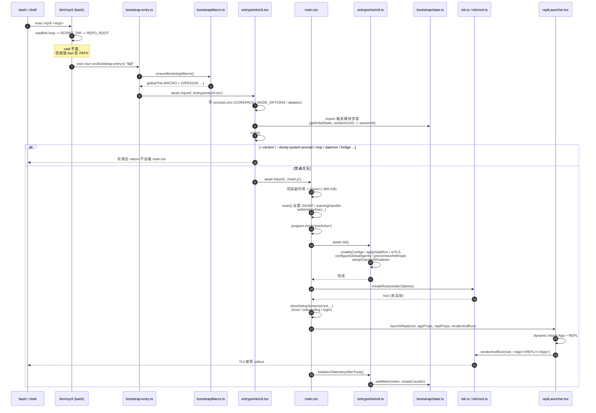

# 启动链路（Boot Sequence）

## 1. 模块作用

`mycli` 是一个 Bun + TypeScript + Ink 的 CLI/TUI。从 shell 输入 `mycli` 到进入 REPL 的过程横跨 **bash 包装脚本 → Bun TS 入口 → 快速路径分发 → Commander 解析 → 全局 init → React/Ink 渲染** 五层。这个链路解决三个问题：

1. **冷启动延迟最小化**：`--version`、`--dump-system-prompt`、`mcp serve`、`daemon-worker` 等"轻量子命令"必须避开把 `main.tsx`（约 4600 行 + 重型依赖）拉进模块图。所以 `cli.tsx` 用一连串 `if (...) { await import(...); return }` 做手动代码分割。
2. **早期副作用必须按顺序生效**：`MACRO.VERSION`（构建时宏注入的版本号）在加载任何业务模块之前就要存在；`COREPACK_ENABLE_AUTO_PIN=0`、`NODE_OPTIONS=--max-old-space-size=8192` 等 env 也要在 `process.env` 读取前打补丁。
3. **session id、cwd、telemetry meter** 等全局状态需要一个唯一来源（`bootstrap/state.ts` 的 `STATE` 单例），其它模块通过 getter/setter 访问，避免循环依赖。

## 2. 关键文件与职责

| file_path | 职责 | 核心导出 |
|---|---|---|
| `bin/mycli` | bash 启动脚本：解析符号链接 → 计算 repo root → exec bun，**保留调用者 cwd** | — |
| `src/bootstrap-entry.ts` | TS 第一行；安装 `globalThis.MACRO`，再动态 import `cli.tsx` | `default` 副作用 |
| `src/bootstrapMacro.ts` | 提供 `globalThis.MACRO` 默认值（version、changelog 等） | `ensureBootstrapMacro()` |
| `src/entrypoints/cli.tsx` | "fast-path 网关"：识别 `--version` / `--dump-system-prompt` / `mcp` / `daemon` / `bridge` / `bg` / `--worktree --tmux` 等并直接处理；其它情况下 `await import('../main.js')` 进入完整 CLI | `main()`（顶级副作用调用） |
| `src/main.tsx` | Commander.js 命令注册、参数解析、preAction 钩子（调用 `init()`）、action handler（构建 session、render REPL）。**约 4600 行，禁止整文件读** | `main()`（被 `cli.tsx` 调用） |
| `src/entrypoints/init.ts` | 一次性全局初始化：`enableConfigs()` → `applySafeConfigEnvironmentVariables()` → mTLS / proxy / preconnect → 注册 cleanup hook → telemetry 延迟初始化 | `init()`（memoized）、`initializeTelemetryAfterTrust()` |
| `src/bootstrap/state.ts` | 全局 `STATE` 对象（cwd、sessionId、模型用量计数、agent color map、各种 latch 标志）；DAG 叶子节点，禁止 import 业务模块 | `getSessionId()`、`switchSession()`、`setMeter()`、`setIsInteractive()` 等 100+ getter/setter |
| `src/replLauncher.tsx` | 把 `<App>` + `<REPL>` 组合后交给 Ink `root.render()` | `launchRepl()` |
| `src/ink.ts` / `src/ink/root.ts` | 自实现 Ink 的入口；`createRoot()` new 一个 `Ink` 类实例，不立刻渲染 | `createRoot()`、`render()` |

## 3. 执行步骤（带代码引用）

1. **bash 引导**：用户敲 `mycli`，shell 解析到 `bin/mycli`（`bun link` 后通常是 `~/.bun/bin/mycli` 软链）。脚本 `bin/mycli:9-13` 沿符号链接回溯到仓库 `bin/`，得到 `REPO_ROOT`。`bin/mycli:17-22` 检查 `bun` 是否在 PATH，最后 `exec bun "$REPO_ROOT/src/bootstrap-entry.ts" "$@"`。**未 cd 到 repo**，调用者的 cwd 原样保留 —— `process.cwd()` 是用户的工作目录，这是 cwd-aware 工具（Read、Edit、Bash）正常工作的前提。
2. **bootstrap-entry**：`src/bootstrap-entry.ts:3` 先执行 `ensureBootstrapMacro()`。`bootstrapMacro.ts:24-29` 检查 `globalThis.MACRO` 不存在则装入默认值（`MACRO.VERSION` = `package.json` 的 version）。然后 `await import('./entrypoints/cli.tsx')` —— 用 await 是因为 cli.tsx 顶层有副作用（直接调用 `main()`）。
3. **cli.tsx 副作用区**：`entrypoints/cli.tsx:5` 立刻把 `COREPACK_ENABLE_AUTO_PIN` 写成 `'0'`。`cli.tsx:9-14` 在 CCR 远程模式下追加 `--max-old-space-size=8192`。`cli.tsx:21-26` ablation baseline 把一组 `CLAUDE_CODE_DISABLE_*` 变量默认置 1。这些 env 必须在业务模块 import 前生效，因为 `BashTool`、`AgentTool` 在模块求值期就把它们读进 const。
4. **cli.tsx fast-path 分发**：`async function main()` 在 `cli.tsx:33` 启动。
   - `cli.tsx:37-42`：单 `--version`/-v/-V 不加载任何模块（连 `startupProfiler` 都不加载）直接 `console.log(MACRO.VERSION)`。
   - `cli.tsx:45-48`：之后才加载 `startupProfiler` 并打首个 `cli_entry` 检查点。
   - `cli.tsx:53-71`：`--dump-system-prompt`（feature flag `DUMP_SYSTEM_PROMPT`）走 `enableConfigs() → getMainLoopModel() → getSystemPrompt()` 输出后退出，不进 main。
   - `cli.tsx:72-93`：`--claude-in-chrome-mcp` / `--chrome-native-host` / `--computer-use-mcp` 各自动态 import 对应 server。
   - `cli.tsx:100-209`：`--daemon-worker`、`bridge` / `daemon` / `ps`/`logs`/`attach`/`kill`、`templates`、`environment-runner`、`self-hosted-runner`、`--worktree --tmux` 等都是 `await import + return`。
   - `cli.tsx:283-285`：`--bare` 提早写 `CLAUDE_CODE_SIMPLE=1`，让模块求值期的 feature gate 看到。
   - `cli.tsx:288-298`：兜底分支 —— `startCapturingEarlyInput()` 抢早期 stdin（避免在 main 加载阶段丢按键），然后 `await import('../main.js')` → 调用其 `main()`。
5. **main.tsx 顶层副作用**：`main.tsx:12` 立刻 `profileCheckpoint('main_tsx_entry')`；`main.tsx:209` 全部 import 完成后打 `main_tsx_imports_loaded`。`main.tsx:585` 暴露 `export async function main()`。
6. **main() 主流程**：
   - `main.tsx:597` 设 `NoDefaultCurrentDirectoryInExePath=1`（Windows PATH 劫持防护）。
   - `main.tsx:600-612` 安装 warning handler 和兜底 SIGINT。
   - `main.tsx:803-818` 解析 `-p` / `--print` / `--init-only` 决定 `setIsInteractive(true|false)` —— **必须发生在 `init()` 之前**，因为 `init()` 内 `getIsNonInteractiveSession()` 决定了 ConfigParseError 时走对话框还是 stderr。
   - `main.tsx:857-861` `eagerLoadSettings()`（解析 `--settings` flag）后调用 `run()`。
   - `main.tsx:908-922` Commander 在 `program.hook('preAction')` 里调用 `await init()` —— 任何子命令 action 启动前都先全量初始化。
7. **init() 全局初始化**：`entrypoints/init.ts:57` 是 memoized async 函数。
   - `init.ts:65` `enableConfigs()` 解锁 settings 读取；
   - `init.ts:74` `applySafeConfigEnvironmentVariables()` 应用安全子集；`init.ts:79` `applyExtraCACertsFromConfig()` 在第一次 TLS 握手前注入 CA；
   - `init.ts:87` `setupGracefulShutdown()` 注册退出 flush；
   - `init.ts:94-105` 后台 fire-and-forget 加载 1P event logger 和 GrowthBook（避免 OpenTelemetry sdk-logs 占用启动路径）；
   - `init.ts:137-150` `configureGlobalMTLS() → configureGlobalAgents() → preconnectAnthropicApi()` 先 mTLS、再代理、最后预热 TCP/TLS 给 Anthropic API；
   - `init.ts:188-189` 注册 LSP 清理；
   - 错误分支 `init.ts:215-237`：`ConfigParseError` 时根据交互态走 stderr 或 `InvalidConfigDialog`。
8. **state.ts 全局初始化**：`bootstrap/state.ts:260` `getInitialState()` 在模块求值期同步执行：用 `realpathSync` 解析 cwd 的真实路径并做 NFC 归一化（`state.ts:263-275`），生成 `randomUUID()` 作为 `sessionId`（`state.ts:331`），并初始化所有 turn-级计数器、prompt cache latch、agent color map 等。`state.ts:429` 立刻冻结 `const STATE = getInitialState()`。**这是模块求值副作用，先于 init() 也先于 cli.tsx 的所有动态 import**：只要 `bootstrap/state.ts` 被任何文件 import 一次，session id 就定下来了。
9. **action handler 内的渲染**：进入主命令 action 后，`main.tsx:2225-2235` 拿 `getRenderContext(false)` 并 `createRoot()`（来自 `src/ink.ts:25`）。`createRoot` 实际上是 `ink/root.ts:129` 的 `new Ink({...})` —— **不渲染**，只占住 stdout。`main.tsx:2247` 调 `showSetupScreens(root, ...)` 把 trust dialog / login / onboarding 一一 mount→unmount 在同一个 root 上。最后 `main.tsx:3739`（resume 路径）或 `main.tsx:3804`（普通路径）调 `launchRepl(root, appProps, replProps, renderAndRun)`。
10. **REPL 挂载**：`replLauncher.tsx:12-22` 同时 `await import('./components/App.js')` 和 `./screens/REPL.js`，组合 `<App {...}><REPL {...}/></App>` 后交给 `renderAndRun(root, element)`。`App.tsx:50-94` 套上三层 Provider：`FpsMetricsProvider → StatsProvider → AppStateProvider`，再嵌一个 `BootstrapBoundary` ErrorBoundary。`REPL` 的根节点又把 `KeybindingSetup`、`MCPConnectionManager`、`FullscreenLayout` 等套进来（详见 `11-tui.md`）。`main.tsx:2603` 在 trust 通过后调 `initializeTelemetryAfterTrust()`，让 OTel meter 异步初始化并写回 `STATE.meter`。

## 4. 流程图

## 5. 与其他模块的交互

- **上游**：仅依赖 `bun`、`process.argv`、`process.env`、stdin/stdout TTY；没有 Node 之外的运行时依赖（fs/path/crypto 都来自 Bun 内建）。
- **下游**：
  - `entrypoints/init.ts` → `utils/config.ts`（settings 加载）、`utils/proxy.ts`、`utils/mtls.ts`、`utils/telemetry/instrumentation.ts`（懒加载）。
  - `bootstrap/state.ts` 是几乎所有模块的依赖（telemetry 计数、cwd、sessionId、color map）。
  - `main.tsx` 之后的链路：`run()` → Commander → action handler → `getRenderContext()` → `createRoot()` → `launchRepl()` → `<App><REPL/></App>` → 进入 `src/screens/REPL.tsx`（见 `11-tui.md`）。
  - 副命令分支：`bridge` 走 `src/bridge/bridgeMain.ts`；`mcp` 子命令在 `main.tsx:3900-3960`；`daemon` 在 `src/daemon/main.ts`；`templates`、`environment-runner` 等都不进 REPL。
- **数据流**：cwd 在 `bin/mycli` 不变 → `state.ts` getInitialState() 用 `realpathSync(cwd()).normalize('NFC')` 写入 `STATE.originalCwd / projectRoot / cwd`。Settings 来自 `init()` 内 `enableConfigs()`，由 `utils/settings/` 读 `~/.mycli/settings.json` 和 `.mycli/settings.local.json`。Telemetry meter 在 trust dialog 通过后才创建，结果写回 `STATE.meter`，所有 counter 通过 `setMeter()` 内的工厂函数生成（`state.ts:948-987`）。

## 6. 关键学习要点

1. **手写代码分割**：`cli.tsx` 用一连串 `feature(FLAG) && await import(...)` 而非依赖打包器分块，是 Bun 没有 dynamic-import 自动分块时的常见做法 —— 而且配合 `feature()` 宏（`bun:bundle`），未启用的 flag 路径会被构建期 DCE 干掉。学 agent 启动优化时这是一个值得抄的 pattern。
2. **副作用顺序就是契约**：`bootstrap-entry.ts` 必须先 `ensureBootstrapMacro` 再 import cli；`cli.tsx` 必须先写 env 再 import 业务；`main.tsx` 必须先 `setIsInteractive` 再 `init()` —— 注释里反复强调"capture into module-level const at import time"。任何打散到 `useEffect`/`init()` 内的尝试都会引入回归。
3. **唯一全局 `STATE` + getter/setter**：`bootstrap/state.ts` 没有 export `STATE` 本身，全部走具名函数。这把"全局状态"压在一个 DAG 叶子文件里，避免循环依赖；同时让 React 不参与全局态（reload-safe，test-resettable via `resetStateForTests`）。
4. **`init()` 是 memoized async**：第二次调用直接返回首个 promise，所以 Commander 多个子命令 preAction 都安全调它。学到的：**全局初始化用 `lodash.memoize` 包成 async 是简洁稳健的写法**。
5. **`createRoot` 而非 `render`**：先建 root 再多次 mount/unmount 不同子树（trust → login → onboarding → REPL），让 Ink 的 alt-screen / cursor 状态全程一致 —— 比每次 `render()` 新建 instance 干净。

## 7. 延伸阅读

- 接下来看：`docs/architecture/11-tui.md`（REPL 挂载点之后的 UI 渲染）、`docs/architecture/02-agent-loop.md`（query 引擎和工具调度，未写）。
- 相关源：
  - `src/utils/config.ts`、`src/utils/settings/`：settings 加载与缓存
  - `src/utils/startupProfiler.ts`：所有 `profileCheckpoint` 的落点
  - `src/utils/gracefulShutdown.ts`：退出 flush 与 cleanup 注册
  - `src/utils/managedEnv.ts`：`applySafeConfigEnvironmentVariables` / `applyConfigEnvironmentVariables` 的差异
  - `src/utils/telemetry/instrumentation.ts`：OTel 懒加载入口
  - `src/services/policyLimits/`、`src/services/remoteManagedSettings/`：trust 之后的远端 settings 链路
  - `MYCLI.md` 仓库根：上游目录级 tour
