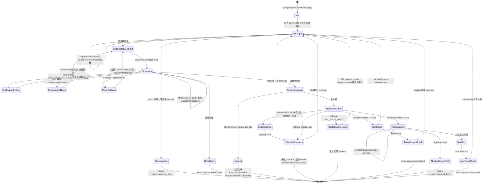
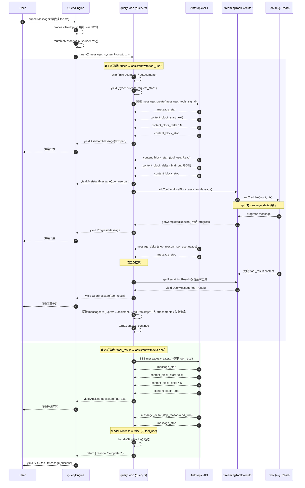

# Agent 主循环（Agent Loop）

> 本文为整套架构文档中最核心的一份。读懂它，等于读懂了 mycli 这个 agent 的"心脏"是怎么跳动的。
> 阅读前置：建议先读 `01-bootstrap.md`（启动链路）。读完本文后再去看 `03-tool-system.md`（工具系统细节）和 `06-compaction.md`（上下文压缩）。

## 1. 模块作用

**Agent 主循环**是把"用户的一句话"变成"模型的最终回答"的引擎，是整个 CLI 的中枢。

它要解决的核心问题只有一个：**让一个无状态的 LLM 在多轮 tool_use ↔ tool_result 往返中持续推进任务，同时优雅地处理流式响应、并发工具、上下文窗口耗尽、用户中断、模型错误、回退等所有现实问题**。

具体来说，主循环每一次"迭代"（iteration）做的事是：

1. 把当前消息数组（`messages`）发给模型，开 SSE 流。
2. 一边接收 streaming chunks，一边把 `tool_use` block 喂给执行器，能并发就并发跑。
3. 模型流结束后，如果还有 `tool_use` 没拿到结果，等结果（其实大多在流式期间就跑完了）。
4. 把 `tool_result`、附件（attachments）、排队命令、文件变更通知等拼回 `messages`。
5. 检查终止条件（没 tool_use → 说明模型给了最终答复 → 结束；否则进入下一轮）。
6. 在中间穿插 token 预算检查、auto-compact、reactive-compact、stop-hooks、max_turns、max_output_tokens 重试等多种横切逻辑。

它**不是**一个递归实现，而是 `while (true)` + `state` 变量的循环。每个 `continue` 点都重新装填一份完整的 `State`（见 `src/query.ts:204`），这样可以避免 9 个独立赋值带来的写漏字段 bug。

## 2. 关键文件与职责

| 文件 | 职责 | 核心导出 |
|---|---|---|
| `src/query.ts` | 主循环本体：流式分发、tool 派发、错误恢复、turn 推进 | `query()`、内部 `queryLoop()` |
| `src/QueryEngine.ts` | 会话级封装：把 `query()` 的事件流翻译成 SDK 语义、维护 `mutableMessages`、记账 usage/cost | `QueryEngine` 类、`submitMessage()` |
| `src/Tool.ts` | 工具接口定义、`ToolUseContext` 类型（详见 03 文档） | `findToolByName`、`type Tool`、`type ToolUseContext` |
| `src/services/tools/StreamingToolExecutor.ts` | 流式期间就启动工具（与模型流并行）；按到达顺序排队、并发安全工具同时跑 | `class StreamingToolExecutor` |
| `src/services/tools/toolOrchestration.ts` | 流结束后的批量执行（fallback 路径，非流式工具执行模式）；做 read-only 批与非 read-only 批的分区 | `runTools()` |
| `src/services/tools/toolExecution.ts` | 单个 tool_use 的实际执行：权限、调度、结果生成 | `runToolUse()` |
| `src/services/api/mycli.ts` | Anthropic messages-streaming 客户端：发送请求、解析 SSE、把 chunks 拼成 `AssistantMessage` | `queryModelWithStreaming()` |
| `src/query/deps.ts` | I/O 依赖注入（`callModel` / `microcompact` / `autocompact` / `uuid`），便于测试桩 | `productionDeps()`、`type QueryDeps` |
| `src/query/stopHooks.ts` | 终止前的钩子链：用户/项目可以在"模型不打算继续"时强制再跑一轮 | `handleStopHooks()` |
| `src/query/tokenBudget.ts` | TOKEN_BUDGET 实验：累计 turn 输出超阈值后注入"继续"提示 | `createBudgetTracker()`、`checkTokenBudget()` |
| `src/utils/abortController.ts` | `AbortController` + 父子链（child 跟随 parent abort） | `createAbortController()`、`createChildAbortController()` |
| `src/types/message.ts` | `Message` 联合类型（注意：仓库内此文件是简化的 shim，字段大量 `[key: string]: unknown`） | `AssistantMessage`、`UserMessage`、`StreamEvent`、`TombstoneMessage` 等 |

## 3. 执行步骤（带代码引用）

下面以**一次 user prompt 抵达 → 直到产出最终 assistant 回答**为线索，按顺序拆解。所有引用形式 `file:line`。

### 3.1 入口：`QueryEngine.submitMessage()`

调用方（无论是 SDK / `bun run dev` 的 REPL / 远程 bridge）拿到 `QueryEngine` 实例之后，调 `submitMessage(prompt)`。它做四件事：

1. 解析用户输入：`processUserInput()`（`src/QueryEngine.ts:416`）。这一步会展开 `/slash` 命令、附加 user context、生成附件等。
2. 把展开后的消息推进 `mutableMessages` 并做 transcript 持久化（`src/QueryEngine.ts:431`、`451`）。
3. 构造一份完整的 `processUserInputContext`（这就是 `ToolUseContext`），见 `src/QueryEngine.ts:492`。
4. 调用 `query()` 并把每个 yield 出来的事件按 SDK 协议翻译外发（`src/QueryEngine.ts:675` 起）。

> 注意：QueryEngine **本身没有 turn 循环**。turn 循环都在 `query()` 里。QueryEngine 的角色更像"翻译适配层 + 持久化"。

### 3.2 进入主循环：`query()` → `queryLoop()`

`query()` 是个非常薄的壳：仅做 `consumedCommandUuids` 收尾通知，真正逻辑在 `queryLoop()`（`src/query.ts:241`）。

`queryLoop` 顶部（`src/query.ts:268`）声明了循环状态：

```text
state = { messages, toolUseContext, autoCompactTracking,
          maxOutputTokensRecoveryCount, hasAttemptedReactiveCompact,
          maxOutputTokensOverride, pendingToolUseSummary,
          stopHookActive, turnCount, transition }
```

每次 `continue` 都必须显式构造一份完整的 `next: State`（`src/query.ts:1715`），这是仓库的有意设计——避免漏写某个字段。

### 3.3 一轮迭代里发生的事

**(a) Pre-flight：消息预处理**（`src/query.ts:307`–`450`）

- 取从最近一次 compact 边界之后的消息：`getMessagesAfterCompactBoundary()`（`src/query.ts:365`）。
- 应用 tool result 容量预算：`applyToolResultBudget()`（`src/query.ts:379`）——超出大小的旧 tool_result 被替换成占位符。
- 顺序穿过若干压缩层：`snipCompactIfNeeded` → `microcompact` → `contextCollapse.applyCollapsesIfNeeded` → `autoCompactIfNeeded`（`src/query.ts:401`–`467`）。这几层是"**层叠的、不互斥的**"，`HISTORY_SNIP` 释放的 token 数会传给 autocompact 让它判断阈值更准。
- 如果 autocompact 触发了，把消息替换成 post-compact 版本并 yield 一系列 boundary message（`src/query.ts:528`）。

**(b) 阻断保护**（`src/query.ts:636`）

如果当前 token 数已经撞硬上限且**没有**任何兜底压缩开关，直接 yield API 错误并 `return { reason: 'blocking_limit' }`（`src/query.ts:646`）。这条防线只在 reactive-compact / context-collapse 都关掉时才生效——开了的话由它们做更聪明的回收。

**(c) 流式 API 调用**（`src/query.ts:659`–`863`）

```text
for await (const message of deps.callModel({ ... })) { ... }
```

`deps.callModel` 默认是 `queryModelWithStreaming()`（`src/services/api/mycli.ts:752`）。它内部用 Anthropic SDK 订阅 SSE，把 `message_start` / `content_block_start` / `content_block_delta` / `content_block_stop` / `message_delta` / `message_stop` 事件做累积，**每个 content_block 完成时就 yield 一条 `AssistantMessage`**（`src/services/api/mycli.ts:2192`），后续 `message_delta` 会回写 usage 与 stop_reason 到已 yield 的最后一条上。

主循环这边对每个流出的 message 做：

1. 按需克隆 + `backfillObservableInput`（给 tool_use 的 input 补"派生字段"，比如把相对路径展开成绝对路径），见 `src/query.ts:747`。注意这里**只克隆 SDK 出口的副本**，原始 message 不变以保护 prompt 缓存的字节对齐。
2. 检查"可恢复错误是否要 withhold"：prompt-too-long、media-size、max-output-tokens 这三类错误**先不 yield 给用户**——等后面恢复链跑完才决定要不要 surface（`src/query.ts:799`–`825`）。
3. 累积 `assistantMessages`、抽 `toolUseBlocks`、置 `needsFollowUp = true`（`src/query.ts:826`）。
4. **关键并行点**：把 tool_use block 立即喂给 `StreamingToolExecutor.addTool()`——工具开始与模型流并行执行（`src/query.ts:841`）。
5. 用 `streamingToolExecutor.getCompletedResults()` 把已经跑完的工具结果**在流尚未结束时**就 yield 出去（`src/query.ts:851`）。

**(d) Streaming fallback**（`src/query.ts:712`–`740`）

如果 SDK 在流中检测到无法在 streaming 下完成（比如某些 thinking 模型场景），回调 `onStreamingFallback()` 置位。主循环把已经收到的"半成品" assistant 消息一并 yield 成 `tombstone`（`src/query.ts:717`），让 UI 撤回它们；丢弃流式工具执行器，新建一个；然后什么也不 break——等同一个 for-await 的下一次迭代里非流式响应完整地补齐。

**(e) 模型 fallback**（`src/query.ts:893`）

当 callModel 抛 `FallbackTriggeredError`（容量压力下切到备选模型），`attemptWithFallback = true` 让外层 while 重试整个请求；先 yield 缺失的 tool_result（避免把模型留在"挂着 tool_use 没回应"的死状态），清空累积，记 `tengu_model_fallback_triggered`，再 `continue`。

**(f) 流结束后的检查**（`src/query.ts:999`–`1050`）

- 跑 `executePostSamplingHooks`（注意是 `void`，不阻塞）。
- 如果 `abortController.signal.aborted` 已置位（用户在流中按了 ESC / 网络断了 / 父请求取消），走 `getRemainingResults()` 把流式执行器里**还没跑完的工具**生成合成 tool_result（synthetic error），保证消息链不破——主循环离开时不能留下"已 yield 的 tool_use 但没 tool_result"的不一致状态（`src/query.ts:1015`）。返回 `{ reason: 'aborted_streaming' }`。

**(g) 终止 vs 继续：`needsFollowUp` 是中枢**（`src/query.ts:1062`）

> `stop_reason === 'tool_use'` 不可靠（API 注释里写明）。`needsFollowUp` 用是否真的拿到了 `tool_use` block 来判断。

如果 `needsFollowUp === false`，进入终止侧的恢复链：

1. **prompt-too-long 恢复**（`src/query.ts:1085`）：如果之前被 withhold 的是 PTL 错误：先尝试 `contextCollapse.recoverFromOverflow()` 一次（"drain"已暂存的 collapse 提交）；不够再 `reactiveCompact.tryReactiveCompact()` 做完整摘要式压缩。任一成功 → 替换 messages、`continue`；都失败 → surface 错误并 `return { reason: 'prompt_too_long' }`。
2. **max_output_tokens 恢复**（`src/query.ts:1188`）：先尝试一次"提升上限"（8k → 64k），不行再注入"接着说，别道歉别复述"的 meta user message 让模型继续；最多重试 `MAX_OUTPUT_TOKENS_RECOVERY_LIMIT = 3`（`src/query.ts:164`）。
3. **API 错误**（`src/query.ts:1262`）：`isApiErrorMessage` 直接 `return { reason: 'completed' }`，**不**走 stop hooks——否则 hook 反复触发会造成"错误 → hook 阻断 → 重试 → 错误"的死循环。
4. **stop hooks**（`src/query.ts:1267`）：用户配置的 stop hook 可能要求"再跑一轮"。如果 hook 返回 blocking errors，把错误注入消息链 `continue`；否则 `return { reason: 'completed' }`。
5. **token budget 续航**（`src/query.ts:1308`）：实验性的 `TOKEN_BUDGET` 特性，turn 累计输出量超阈值时注入 nudge message 让模型继续。

如果 `needsFollowUp === true`，进入工具执行 + 推进下一 turn 的路径（见 3.4）。

### 3.4 工具执行的两种模式

**模式 A：流式工具执行（默认开启时）**（`src/query.ts:1380`）

工具大多在流式期间已经被 `StreamingToolExecutor.addTool()` 启动。这里调 `streamingToolExecutor.getRemainingResults()` 把还没结束的等齐、按"模型 yield 顺序"流出。

执行器内部规则（见 `StreamingToolExecutor.ts`）：

- **并发安全 vs 不安全**：每个 Tool 实现都有 `isConcurrencySafe(input)` 谓词。一组连续的 read-only（如 Read / Glob / Grep）可以同时跑；遇到一个不安全的（如 Edit / Bash），它必须独占执行（`src/services/tools/StreamingToolExecutor.ts:129`）。
- **并发上限**：`CLAUDE_CODE_MAX_TOOL_USE_CONCURRENCY` 环境变量，默认 10（`src/services/tools/toolOrchestration.ts:8`）。
- **Bash 错误连坐**：如果一个 Bash 工具报错，会触发 `siblingAbortController.abort('sibling_error')` 把同批其他兄弟工具杀掉（`src/services/tools/StreamingToolExecutor.ts:359`）；其他工具（Read 等）即使报错也**不**连坐——它们之间没有隐式依赖。
- **用户中断**：若 `abortController.signal.reason === 'interrupt'`（用户在工具运行时输入新内容），只取消 `interruptBehavior() === 'cancel'` 的工具；`block` 类型的工具（Edit、写入类）继续跑完——它们一旦中途取消会留下半完成的副作用。

**模式 B：批量工具执行（fallback 路径）**（`src/services/tools/toolOrchestration.ts:19`）

如果 streaming tool execution 没开启或被丢弃，退回 `runTools()`。它把工具列按"是否并发安全"做分桶：连续的 concurrency-safe 工具放一桶并发跑（`runToolsConcurrently`），其余的一桶一个串行跑（`runToolsSerially`）。语义和模式 A 等价，只是时机不同——这里是流结束后才开跑。

### 3.5 turn 末尾：拼接、推进

工具执行结束后（`src/query.ts:1409` 起）：

1. **生成 tool_use_summary**（haiku 调用，"刚跑了哪些工具、做了什么"的 ~1 句话总结），异步 fire-and-forget，结果在**下一次迭代开头**才 await（流式期间 ~5–30s 用来掩盖 haiku 的 ~1s）（`src/query.ts:1469`）。
2. 拉队列里的"插队消息"（task notification、用户在工具运行时排队的新输入）作为 attachment 注入（`src/query.ts:1580`）。
3. 消费 memory prefetch / skill discovery prefetch 的结果作为 attachment（`src/query.ts:1599`、`1620`）。
4. 如果新 MCP 服务上线，刷新 tool 列表（`src/query.ts:1660`）。
5. 检查 `maxTurns`，超了 yield `max_turns_reached` 附件并返回（`src/query.ts:1705`）。
6. 把 `[...messagesForQuery, ...assistantMessages, ...toolResults]` 装入 `state.messages`，`turnCount + 1`，`continue`（`src/query.ts:1715`）。

### 3.6 终止状态

主循环最终的 `Terminal` 返回值是个带 `reason` 的对象，覆盖了 12 种终止原因（`src/query.ts:646`–`1711`）：

```
blocking_limit / image_error / model_error / aborted_streaming / aborted_tools
prompt_too_long / completed / stop_hook_prevented / hook_stopped
max_turns / next_turn(实际不出现在 Terminal) / ...
```

QueryEngine 收到流结束后（`src/QueryEngine.ts:1058` 起）查找最后一条 `assistant | user` 消息判断成功；不是预期形态就 yield `error_during_execution`，否则 yield `subtype: 'success'` 的 result（`src/QueryEngine.ts:1135`）。

## 4. 流程图

### 4.1 状态机（`stateDiagram-v2`）



### 4.2 一轮完整往返（`sequenceDiagram`）

下面这张图描绘 user 发送 prompt → 直到模型不再 tool_use（拿到最终回答）的一次完整 round-trip。注意 **streaming 与 tool execution 是并行的**。



## 5. 与其他模块的交互

**上游（谁调进来）**

- `src/main.tsx` 的 REPL 路径会构造 `ToolUseContext` 并直接调 `query()`（不走 QueryEngine——REPL 自己做 transcript 和 UI）。
- `src/QueryEngine.ts` 是 SDK / `--print` / 远程 bridge 的入口包装。
- `src/tools/AgentTool/` 的子 agent 会**递归**调 `query()`（叫 fork agent）；`toolUseContext.agentId` 标记主线程 vs 子代理。

**下游（主循环依赖什么）**

- `src/services/api/mycli.ts::queryModelWithStreaming`：唯一的"模型对话"出口，封装了 SSE 拉取、retry、VCR fixture、cache breakpoint 注入。
- `src/services/compact/*`：autocompact / microcompact / reactiveCompact / contextCollapse / snipCompact 都是主循环 pre-flight 的横切层，详见 `06-compaction.md`。
- `src/services/tools/*`：`StreamingToolExecutor` / `runTools` / `runToolUse` 是工具执行栈，详见 `03-tool-system.md`。
- `src/utils/messages.ts`：`createUserMessage` / `normalizeMessagesForAPI` 等消息构造器。
- `src/query/stopHooks.ts`、`src/query/tokenBudget.ts`：本目录下的小帮手，专门拆出来便于测试。

**消息链结构（数据流）**

主循环维护的 `messages` 数组按时间顺序如下：

```
[前次 compact boundary?]
  → [user message: prompt]
  → [attachment: nested memory / skill / file change ...]
  → [assistant message: text]
  → [assistant message: tool_use (Read)]
  → [user message: tool_result (Read 输出)]
  → [attachment: edited_text_file 通知]
  → [assistant message: text "我读完了，看到 ..."]
  → [user message: 下一个 prompt]
  → ...
```

注意：

- **meta message** (`isMeta: true`) 是注入给模型但 UI 隐藏的辅助消息，比如 max-output-tokens 恢复时的 `"Output token limit hit. Resume directly..."`（`src/query.ts:1224`）、token budget nudge（`src/query.ts:1325`）。
- **attachment** 是 `type: 'attachment'` 的特殊消息，承载文件变更、memory、skill 注入、`max_turns_reached` 信号等；它们在 `getAttachmentMessages()` 里产出（`src/query.ts:1580`）。
- **tombstone message** 不进 messages 数组，是给 UI 的"撤回"控制信号（`src/query.ts:717`）。
- **tool_use_summary** 同上，仅用于 UI/SDK 展示，不影响 prompt 缓存。

**Prompt 缓存对齐：一条铁律**

主循环非常小心地"不修改已经提交过给 API 的消息"——任何字段更动会让 prompt 缓存命中失败，极大增加成本。`backfillObservableInput` 一节明确：克隆出"yield 给 UI 用的"副本，但 push 进 `assistantMessages` 用于回喂 API 的**原始** message 完全不动（`src/query.ts:747`）。这是阅读这段代码时最容易忽略的细节。

## 6. 关键学习要点

1. **不递归，靠 `while(true) + state` 推进**。工程上比"一个 turn 函数互相调"更好维护：所有横切关注点（compaction、abort、recovery、token budget）都在一处汇合，没有"哪个 case 漏处理"的隐患。每次 `continue` 必须显式装填整份 State 是项目的硬约束。
2. **流式分发 + 工具并发是性能护城河**。`StreamingToolExecutor` 把 tool 执行揉进流式期间，read-only 工具组并发跑、Bash 等不安全工具独占跑。`CLAUDE_CODE_MAX_TOOL_USE_CONCURRENCY` 默认 10——你写 agent 时应该思考自己的"工具并发安全边界"在哪。
3. **Withhold-then-recover 的错误恢复模型**值得抄作业。prompt-too-long、max_output_tokens、media-size 这三类**可恢复的 API 错误**先不 surface 给上层（withheld），等恢复链跑完再决定 yield 还是替换；replay/fallback 是这个模型的"具体施工方法"，避免了 SDK 消费者看到中间错误就退出会话。
4. **Abort 必须保证消息链一致**。`yieldMissingToolResultBlocks()`（`src/query.ts:123`）和 `getRemainingResults()` 的合成 tool_result 都是为了同一件事——任何 `tool_use` 都必须有对应 `tool_result`，否则下次发请求 API 直接 400。设计你自己的 agent 时，**这条不变量是最容易被中断/异常路径踩坏的**。
5. **`needsFollowUp` 是循环终止的唯一权威信号**。源码注释明确写 `stop_reason === 'tool_use'` 不可靠（`src/query.ts:553`）——只看是否真的累积到了 tool_use block。换句话说：**别相信模型说"我要调用工具"，相信流里真的来了 tool_use block**。
6. **依赖注入 = 可测性**。`QueryDeps`（`src/query/deps.ts`）只暴露 4 个 IO 桩（callModel、microcompact、autocompact、uuid）。这是该项目工程化的好范例——不要 `jest.spyOn(everything)`，给关键 IO 一个干净的注入入口。

## 7. 延伸阅读

- **直接读源码** `src/query.ts:241-1729`——这是整个仓库最值得逐行精读的一份文件。
- `src/QueryEngine.ts`：搞清楚一次 `submitMessage()` 怎么把内部事件流外翻成 SDK 协议。
- `src/services/api/mycli.ts:752-2400`：streaming 客户端的实际拼装（content_block 累积逻辑较为复杂，建议直接读源码）。
- `src/services/tools/StreamingToolExecutor.ts`：工具并发调度，重点看 `processQueue` / `executeTool` / `getAbortReason`。
- `src/services/tools/toolOrchestration.ts`：批量执行的分桶逻辑（短小，10 分钟读完）。

**建议下一份阅读：**

- `03-tool-system.md` —— Tool 接口、ToolUseContext、isConcurrencySafe、permission flow 都在那里展开。
- `06-compaction.md` —— 主循环 pre-flight 的多层压缩到底各自做什么。
- `07-streaming-and-api.md` —— SSE 解析与 retry 细节。

> **看不懂的地方坦白说**：`src/services/api/mycli.ts:1980-2400` 那一段 SSE 累积有大量在线状态机（partialMessage、contentBlocks、cache_deleted_input_tokens、research 字段回写等），本文未深入展开——建议直接读源码而不是依赖二手描述，本人理解尚不够全面以一一翻译。同样，`Terminal` / `Continue` 类型从 `src/query/transitions.ts` 导入但该文件实际只导出 `transitionQueryState`，看起来是 source-map 还原后的 shim，类型系统能编但运行时类型信息不全；阅读时以 query.ts 里 `return { reason: ... }` 的 12 个具体出口为准，不要被类型名误导。
