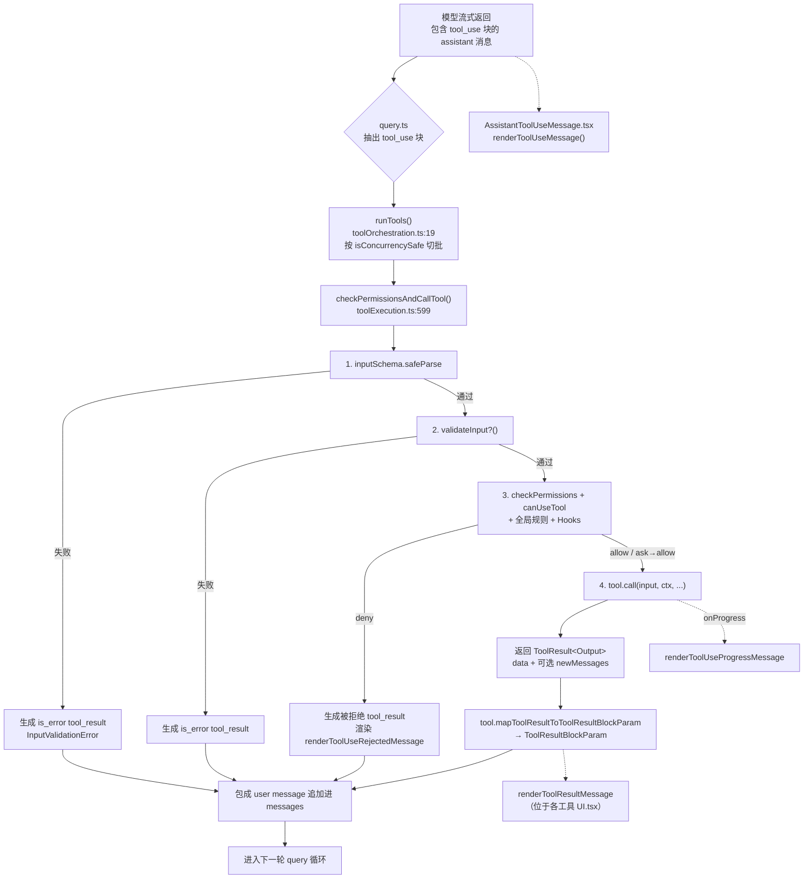

# 03 — 工具系统（Tools Framework）

> 目标读者：想要给 mycli 增加新工具、调试工具调用流程，或者搞清楚「模型说要调用一个工具之后到底发生了什么」的人。

## 1. 模块作用

工具系统是 mycli 把「模型决策」变成「真实副作用」的桥梁。它要解决四件事：

1. **把可用工具描述（input_schema、prompt 片段）告诉模型**，让 Anthropic Messages API 在采样阶段直接生成 `tool_use` 内容块。
2. **解析模型返回的 `tool_use` 块**，按 zod schema 校验入参，决定是否要权限、是否要异步、是否要分组。
3. **执行工具体（`tool.call(...)`）**，把它的结果映射成 `tool_result` 块，回灌进下一轮 messages，让模型继续推理。
4. **渲染**：在 Ink TUI 里画出工具调用过程（标题、进度、结果、错误、被拒绝……）。

工具是 mycli 的"动词"，而 agent loop（`src/query.ts`）是"句法"。两者通过 `Tool` 接口（`src/Tool.ts`）解耦。

## 2. 关键文件与职责

| 文件 | 职责 |
| --- | --- |
| `src/Tool.ts` | `Tool` / `Tools` / `ToolUseContext` / `ToolResult` 等类型定义；`buildTool()` 工厂用于补默认方法；`findToolByName` 等小工具。 |
| `src/tools.ts` | `getAllBaseTools()` 给出全量内建工具；`getTools(permissionContext)` 按权限上下文过滤；`assembleToolPool()` / `getMergedTools()` 把内建 + MCP 工具合并并去重。 |
| `src/services/tools/toolOrchestration.ts` | `runTools()` —— 把模型一次返回的多个 `tool_use` 块按是否 concurrency-safe 切成"并发批"和"串行批"，逐批喂给执行器。 |
| `src/services/tools/toolExecution.ts` | `checkPermissionsAndCallTool()` —— 单个 `tool_use` 的完整生命周期：zod 校验 → `validateInput` → `checkPermissions` + `canUseTool` 钩子 → `tool.call` → `mapToolResultToToolResultBlockParam` → 写入 messages。 |
| `src/services/tools/StreamingToolExecutor.ts` | 流式执行器：一边接收 SSE，一边启动可以并发的工具，避免等整段消息收齐。 |
| `src/query.ts` | 主 agent loop。把 `tool_use` 块抽出后调用 `runTools()`，再把生成的 `user/tool_result` 消息追加进 messages 进入下一轮。 |
| `src/components/messages/AssistantToolUseMessage.tsx` | 渲染 `tool_use` 块（标题 + 进度行 + 排队/等待权限提示）。 |
| `src/components/messages/UserToolResultMessage.tsx`、各工具 `UI.tsx` | `tool.renderToolResultMessage` 调用入口；具体外观由每个工具自带的 React 组件决定。 |
| `src/tools/<ToolName>/` | 每个工具一个目录。常见约定：`*Tool.tsx` 主入口、`prompt.ts` 提供给模型的 system prompt 片段、`UI.tsx` 渲染、`constants.ts` 工具名常量。 |

## 3. 执行步骤（带 `file:line` 引用）

### 3.1 工具定义（编译期）

每个工具通过 `buildTool({...} satisfies ToolDef)` 生成（`src/Tool.ts:783`）。`buildTool` 的作用是把 `isEnabled / isReadOnly / isConcurrencySafe / checkPermissions / userFacingName` 等可选方法的默认值补齐（见 `TOOL_DEFAULTS`，`src/Tool.ts:757`）。

`Tool` 接口本身定义了 ~30 个可选方法，但真正被 agent loop **必需**的只有：

- `name`（`Tool.ts:456`）—— 模型寻址用。
- `inputSchema`（`Tool.ts:394`）—— zod schema，序列化后作为 `input_schema` 发给 Anthropic API。
- `prompt(options)`（`Tool.ts:518`）—— 工具的 system prompt 描述。
- `call(args, ctx, canUseTool, parentMessage, onProgress)`（`Tool.ts:379`）—— 实际执行体，返回 `ToolResult<Output>`。
- `mapToolResultToToolResultBlockParam(content, toolUseID)`（`Tool.ts:557`）—— 把 `Output` 序列化为发回模型的 `tool_result` 内容块（`text` 或 `image` 数组）。
- `checkPermissions(input, ctx)`（`Tool.ts:500`）—— 决定是否需要弹窗 / 是否被规则拒绝。

### 3.2 工具池组装（每轮请求前）

`src/tools.ts:271` 的 `getTools(permissionContext)` 是工具池的入口：

1. 调 `getAllBaseTools()`（`tools.ts:193`）拿到全部内建工具。`AgentTool` 永远第一个，后面是 Bash / Read / Edit / Grep / Glob / TodoWrite / WebFetch / WebSearch / Skill ……还有大量 `feature(FLAG) ? require(...) : null` 的条件项（`tools.ts:14-95`），靠 Bun bundle macro 在外部构建里被死代码消除。
2. 用 `filterToolsByDenyRules`（`tools.ts:262`）过掉 `permissionContext.alwaysDenyRules` 命中的工具。
3. 如果 REPL 模式开启，把 Bash/Read/Edit 等"原语"从直接可见列表里隐掉（它们仍然能在 REPL VM 里调用）。
4. 最后用 `tool.isEnabled()` 再筛一遍。

`assembleToolPool(permissionContext, mcpTools)`（`tools.ts:345`）在此基础上再合并 MCP 工具，并按字典序排序——这是为 prompt 缓存稳定性服务的（注释见 `tools.ts:354-361`）。

### 3.3 模型发出 `tool_use`

API 客户端（`src/services/api/mycli.ts` / `openaiCompatibleClient.ts`）以 streaming 方式返回 SSE。`StreamingToolExecutor` 负责一边解析一边启动 concurrency-safe 工具；非 streaming 路径在 `query.ts:1382` 退化到 `runTools(toolUseBlocks, assistantMessages, canUseTool, toolUseContext)`。

`runTools()`（`src/services/tools/toolOrchestration.ts:19`）按 `tool.isConcurrencySafe(input)` 把 tool_use 切成"并发组"和"串行组"，并发组用 `runToolsConcurrently`（`toolOrchestration.ts:152`），其余 `runToolsSerially`（`toolOrchestration.ts:118`）。

### 3.4 单个 tool_use 的处理

核心函数：`checkPermissionsAndCallTool`（`src/services/tools/toolExecution.ts:599`）。流程：

1. **schema 校验** —— `tool.inputSchema.safeParse(input)`（`toolExecution.ts:615`）。失败直接生成一条 `tool_result` user message，`is_error: true`，content 是 `<tool_use_error>InputValidationError: ...</tool_use_error>`（`toolExecution.ts:664-680`），跳过执行。
2. **业务校验** —— `tool.validateInput?.(parsed.data, ctx)`（`toolExecution.ts:683`）。例如 BashTool 在这里拦截 `sleep N` 这种被禁掉的命令（`BashTool.tsx:524`）。
3. **权限决策** —— `resolveHookPermissionDecision(...)`（`toolExecution.ts:921`）综合三件事：
   - `tool.checkPermissions(input, ctx)`（工具自身的逻辑，例如 BashTool 的 `bashToolHasPermission`，`BashTool.tsx:539`）。
   - `permissions.ts` 里的全局 allow/deny 规则。
   - 钩子（PreToolUse 等）和 `canUseTool` 回调（用于交互式弹窗、auto-mode 分类器）。

   返回 `behavior: 'allow' | 'ask' | 'deny' | 'passthrough'`，并可能给一个 `updatedInput`（钩子可以改写参数）。
4. **执行 `tool.call`** —— `toolExecution.ts:1207`：
   ```ts
   const result = await tool.call(callInput, { ...toolUseContext, toolUseId, userModified }, canUseTool, assistantMessage, onProgress)
   ```
   `result.data` 是工具自定义的 Output 类型；`onProgress` 让工具在执行中推送 `progress` 消息（Bash 的 stdout、AgentTool 的子轮次……）。
5. **结果映射** —— `tool.mapToolResultToToolResultBlockParam(result.data, toolUseID)`（`toolExecution.ts:1292`），返回 Anthropic SDK 的 `ToolResultBlockParam`：

   ```ts
   { tool_use_id, type: 'tool_result', content: string | Array<TextBlock | ImageBlock>, is_error?: boolean }
   ```
6. **回灌 messages** —— 这条 `tool_result` 块被包进一条 `user` message（`createUserMessage(...)`）追加到 `messages` 数组。`query.ts` 拿到追加后的列表立刻进入下一轮 API 调用。

### 3.5 渲染

每条 `tool_use` 块由 `AssistantToolUseMessage.tsx` 渲染（`src/components/messages/AssistantToolUseMessage.tsx:304` 的 `renderToolUseMessage`）。它的工作就是 `tool.renderToolUseMessage(parsed.data, { theme, verbose, commands })`。

工具结果由 `tool.renderToolResultMessage(output, progressMessages, options)` 渲染——例如 BashTool 的 `BashToolResultMessage.tsx`、AgentTool 的 `UI.tsx`。如果工具不实现这个方法（如 `TodoWriteTool`，见 `TodoWriteTool.ts:62`），结果就不在 transcript 里渲染（todo 走单独的 panel）。

进度消息走 `tool.renderToolUseProgressMessage`（`AssistantToolUseMessage.tsx:236-249`），错误用 `renderToolUseErrorMessage`，被拒绝用 `renderToolUseRejectedMessage`，它们都有 fallback 实现（`FallbackToolUseRejectedMessage` / `FallbackToolUseErrorMessage`）。

## 4. 流程图



## 5. 与其他模块的交互

- **agent loop（`src/query.ts`）**：唯一调用 `runTools` 的地方，它持有 `messages` 数组并负责把 `tool_result` 拼回去。
- **权限系统（`src/utils/permissions/`）**：`Tool.checkPermissions` 之外，还有全局 allow/deny 规则、`PermissionMode`（default / acceptEdits / bypassPermissions / plan / auto）。`acceptEdits` 等模式会让某些工具的弹窗自动放行（详见 `bashToolHasPermission` 等实现）。
- **Hooks（`src/utils/hooks/`）**：PreToolUse / PostToolUse / PermissionRequest 钩子在 `checkPermissionsAndCallTool` 周围被触发，可以修改输入、决定权限、记录审计。
- **MCP（`src/services/mcp/`）**：MCP 服务器通过 `fetchToolsForClient` 拉到 `Tool` 对象（`isMcp: true`），与内建工具共享同一接口，由 `assembleToolPool` 合并。
- **Subagent（`src/tools/AgentTool/`）**：`AgentTool` 本身就是一个工具——它的 `call()` 启动一个独立的 query loop（详见 `04-subagents.md`）。
- **Tool Search（`src/tools/ToolSearchTool/`）**：当工具池太大，会把部分工具标记 `shouldDefer: true`，模型必须先调 `ToolSearch` 才能拿到它们的 schema。这是缓存优化的一部分。

## 6. 关键学习要点

1. **`Tool` 接口很大但默认值更大**：`buildTool` 的 `TOOL_DEFAULTS`（`Tool.ts:757`）让 90% 的方法可以省略。新写工具只需要实现 `name / inputSchema / prompt / call / mapToolResultToToolResultBlockParam / checkPermissions（可选）/ renderToolUseMessage` 这一小串。

2. **`tool_result` 是 user 消息**：Anthropic Messages API 的约定。把工具结果包成 `role: 'user'`、`content: [{ type: 'tool_result', tool_use_id, content }]`，模型下一轮就能"看见"这次调用的产出。`mapToolResultToToolResultBlockParam` 是这层翻译的唯一入口。

3. **`isConcurrencySafe(input)` 决定并发策略**：BashTool 的实现是 `this.isReadOnly?.(input) ?? false`（`BashTool.tsx:434`）——只读命令并发，写命令串行。`runToolsConcurrently` / `runToolsSerially` 在 `toolOrchestration.ts` 用这个标志切批。

4. **渲染和 API 是两条路**：`renderToolUseMessage` / `renderToolResultMessage` 给 TUI 看；`mapToolResultToToolResultBlockParam` 给模型看。两者可以差很多——例如 `BashTool` 的 mapTo... 会附加 `<persistedOutputPath>` 包装、background hint，但 UI 渲染不会显示这些（注释见 `BashTool.tsx:546-548`）。所以同一份输出有两种序列化。

5. **shouldDefer 与 ToolSearch**：当工具池很大时，每轮请求重发所有工具的 schema 会爆缓存。`shouldDefer: true` 的工具只把 `name + searchHint` 放进初始提示，模型必须先用 `ToolSearch` 关键字查询才能拿到它的 `input_schema`。这是一个"懒加载工具"的机制。

## 7. 延伸阅读

- `MYCLI.md` 顶层目录里"Agent loop and tools"一节给出了文件级地图。
- `src/Tool.ts` 顶部的 `ToolUseContext` 注释（约 158 行起）解释了上下文里每个回调的意义——读懂它就能理解工具能做的所有副作用边界。
- 想看一个最小工具示例：`src/tools/TodoWriteTool/TodoWriteTool.ts`（115 行包含全部）。
- 想看一个复杂工具：`src/tools/BashTool/BashTool.tsx`（1100+ 行，权限、沙箱、后台进程、sed-edit 转 file-edit 等都在里面）。
- 想看一个会启动子 agent 的工具：`src/tools/AgentTool/AgentTool.tsx`，参考下一篇 `04-subagents.md`。
