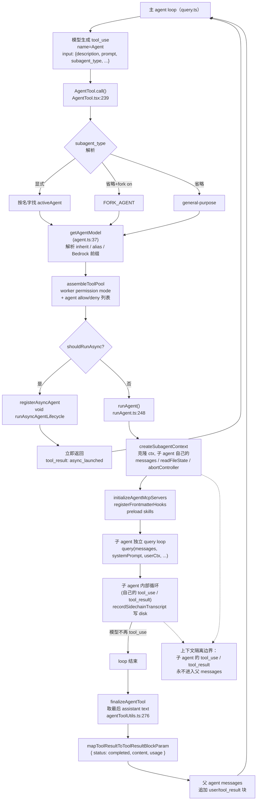

# 04 — Subagent 机制

> 目标读者：想搞清楚「主 agent 怎么委派任务给子 agent」、「子 agent 的上下文/工具/模型从哪来」、以及「怎么自定义一个新 subagent」的人。

## 1. 模块作用

Subagent 是 mycli 的**层级委派**机制。主 agent 在循环中如果决定用 `Agent` 工具，就会启动一个**全新的 query loop**——它有自己的 system prompt、自己的 messages、自己的 tool 池、（通常）自己的 `AbortController`、甚至自己的 model。子 agent 跑完后，**只把最后一条 assistant 消息的文本**当作结果返回给父 agent；中间的 tool_use / tool_result 全部不会进父 agent 的上下文。

这带来三个好处：

1. **上下文隔离** —— 子 agent 探索代码时产生的几十万 token 不会污染主 agent 的窗口。
2. **能力裁剪** —— 内建 `Explore` / `Plan` 等 read-only agent 通过 `disallowedTools` 屏蔽 Edit/Write，模型物理上无法越权。
3. **专门化 prompt** —— 每个 subagent 类型都有独立的 system prompt（如 `statusline-setup` 教模型读 `~/.zshrc` 改 PS1），与主 agent 的通用 prompt 解耦。

mycli 提供 5 个内建 subagent，用户/项目还能在 `~/.mycli/agents/*.md`、`<project>/.mycli/agents/*.md` 里写 markdown frontmatter 定义自己的。

## 2. 关键文件与职责

| 文件 | 职责 |
| --- | --- |
| `src/tools/AgentTool/AgentTool.tsx` | `Agent` 工具入口（1397 行）。处理 input schema、子 agent 选择、worktree/远程隔离、同步 vs 异步分支、teammate 多 agent 分发、最终把结果映射成 `tool_result`。 |
| `src/tools/AgentTool/runAgent.ts` | 实际启动子 agent 的核心。组装 system prompt、user/system context、permission context、tool 池，构造 `agentToolUseContext`，进入 `query()` 循环并把消息一条条 yield 出来。 |
| `src/tools/AgentTool/loadAgentsDir.ts` | 加载 agent 定义：built-in、plugin、`~/.mycli/agents/`、项目 `.mycli/agents/`、policy、flag。提供 `getAgentDefinitionsWithOverrides()`、解析 markdown frontmatter / JSON 两种形态。 |
| `src/tools/AgentTool/builtInAgents.ts` | 注册内建 agent 列表（按 feature flag / 入口类型筛选）。 |
| `src/tools/AgentTool/built-in/generalPurposeAgent.ts` | `general-purpose`：通用研究/搜索 agent，`tools: ['*']`，模型 inherit。 |
| `src/tools/AgentTool/built-in/exploreAgent.ts` | `Explore`：只读搜索专家，禁 Edit/Write/NotebookEdit/Agent/ExitPlanMode；外部用户用 `haiku`，ant 内部用 inherit。 |
| `src/tools/AgentTool/built-in/planAgent.ts` | `Plan`：只读架构规划 agent，model: inherit，输出步骤+关键文件清单。 |
| `src/tools/AgentTool/built-in/statuslineSetup.ts` | `statusline-setup`：教模型把 shell PS1 转成 statusLine 配置；只能用 Read/Edit。 |
| `src/tools/AgentTool/built-in/mycliCodeGuideAgent.ts` | `claude-code-guide`：回答关于 mycli/Claude API/Agent SDK 文档的问题；只在非 SDK 入口里启用。 |
| `src/utils/model/agent.ts` | `getAgentModel()`：解析 subagent 该用什么模型。处理 `'inherit'` / 同 tier 别名 / Bedrock 区域前缀继承。 |
| `src/utils/forkedAgent.ts` | `createSubagentContext()`：克隆父 agent 的 `ToolUseContext`，按 sync/async 决定哪些回调共享、哪些断开（如 `setAppState`）。 |
| `src/tools/AgentTool/agentToolUtils.ts` | `finalizeAgentTool()`：从子 agent 的最后一条 assistant 消息提取文本，组装 `AgentToolResult`（content + token/duration 统计）。 |
| `src/utils/sessionStorage.ts`（部分） | `recordSidechainTranscript()`：把子 agent 的 transcript 写到 disk 单独的 sidechain 文件，方便事后查看，但**不进父 agent 的 messages**。 |

## 3. 执行步骤（带 `file:line` 引用）

### 3.1 主 agent 调用 `Agent` 工具

模型在主循环中生成一个 `tool_use` 块，name=`Agent`（在某些发布里别名为 `Task`），input 形如：

```json
{ "description": "Find OAuth code", "prompt": "Search for...", "subagent_type": "Explore", "model": "sonnet", "run_in_background": false }
```

走通用工具路径（参考 `03-tools-framework.md`）后，进入 `AgentTool.call()`（`src/tools/AgentTool/AgentTool.tsx:239`）。

### 3.2 选择 agent definition

`AgentTool.tsx:322-356`：

- 如果 `subagent_type` 显式给了，从 `toolUseContext.options.agentDefinitions.activeAgents` 找匹配。
- 如果省略且 fork-subagent 实验开启，走 `FORK_AGENT` 分支（克隆父 agent）。
- 否则默认 `general-purpose`。
- 同时按 `permissionContext` 的 deny 规则过滤（`Agent(Explore)` 这种 deny 会让 Explore 不可见）。

### 3.3 解析模型

`getAgentModel(agentDef.model, mainLoopModel, toolModelOverride, permissionMode)`（`src/utils/model/agent.ts:37`）：

1. 环境变量 `CLAUDE_CODE_SUBAGENT_MODEL` 最高优先（`agent.ts:43`）。
2. 工具入参 `model`（如 `sonnet`/`opus`/`haiku`）次之（`agent.ts:70`）。
3. agent definition 自己声明的 `model` 字段。
4. **缺省值是 `'inherit'`**（`getDefaultSubagentModel`，`agent.ts:25`）—— 与父 agent 同模型。
5. **`'inherit'` 不是直接拿 `parentModel`，而是再走一遍 `getRuntimeMainLoopModel()`**（`agent.ts:83`）—— 这样在 plan mode 下 `opusplan` → `Opus` 这类运行时改写也能生效。
6. 当用户传的是同 tier 别名（`opus` 而父 agent 跑 `claude-opus-4-6`），返回父 agent 的**完整型号**而不是 alias 默认（`aliasMatchesParentTier`，`agent.ts:110`）—— 防止 Vertex/Bedrock 用户被悄悄降级（issue #30815）。
7. Bedrock 跨区域前缀（`eu.` / `us.`）会从父 agent 继承到子 agent（`agent.ts:50-67`）。

### 3.4 组装子 agent 工具池

`AgentTool.tsx:573-577` 用**子 agent 自己的 permission mode**重新调 `assembleToolPool`，**不**复用父 agent 已经过滤过的 `toolUseContext.options.tools`：

```ts
const workerPermissionContext = { ...appState.toolPermissionContext, mode: selectedAgent.permissionMode ?? 'acceptEdits' }
const workerTools = assembleToolPool(workerPermissionContext, appState.mcp.tools)
```

进 `runAgent` 后再走 `resolveAgentTools`（`runAgent.ts:500`）按 agent definition 的 `tools` allowlist / `disallowedTools` denylist 二次过滤。

### 3.5 同步 vs 异步分支

`AgentTool.tsx:557-567` 的 `shouldRunAsync` 综合多种触发：用户传 `run_in_background`、agent definition 里 `background: true`、coordinator mode、fork 实验、proactive、Kairos assistant mode……

- **异步**：`registerAsyncAgent()` 注册一个 `LocalAgentTask`，`void runWithAgentContext(...)` fire-and-forget 跑 `runAsyncAgentLifecycle`，立刻返回 `{ status: 'async_launched', agentId, outputFile, ... }`。父 agent 拿到的 `tool_result` 是一段「我已经在后台启动了」的提示，结果稍后通过 `<task-notification>` user message 进来（参见 `tasks/LocalAgentTask`）。
- **同步**：`runAgent(...)` 返回的 async iterator 在主循环里逐条消费（`AgentTool.tsx:840+`），进度推给父 agent 的 spinner，最后调 `finalizeAgentTool()` 抽出文本，包成 `{ status: 'completed', content, totalTokens, ... }`。

### 3.6 `runAgent()` 内部

`src/tools/AgentTool/runAgent.ts:248`，关键步骤：

1. **agentId 生成 + Perfetto 注册**（`runAgent.ts:347-359`）：每个子 agent 一个 UUID，可在 trace 里看到层级。
2. **forkContextMessages 处理**（`runAgent.ts:370-373`）：默认子 agent 从空 messages 开始；只在 fork-subagent 路径下，会把父的全部 messages 传过去（必须先用 `filterIncompleteToolCalls` 把孤儿 tool_use 过滤掉，否则 API 报错）。
3. **userContext / systemContext 处理**（`runAgent.ts:380-410`）：默认拷父的；但 `omitClaudeMd: true` 的 agent（Explore/Plan）会丢掉 MYCLI.md（节省 token），Explore/Plan 还会丢掉 gitStatus。
4. **permission context 重建**（`runAgent.ts:416-498`）：`agentGetAppState` 是个闭包——每次 query loop 读 AppState 时都会按 agent definition 的 `permissionMode` 改写当前 mode、按 `allowedTools` 重置 session 级 allow rules、按 `effort` 改写 effortValue。
5. **system prompt 组装**（`runAgent.ts:508-518` + `getAgentSystemPrompt`，`runAgent.ts:906`）：拿 `agentDefinition.getSystemPrompt({ toolUseContext })` 的内容，加上 `enhanceSystemPromptWithEnvDetails`（注入 cwd、平台、工具能力提示等）。
6. **AbortController**（`runAgent.ts:524-528`）：异步 agent 拿一个**未连接父 controller 的新 controller**——这样用户在主线程按 ESC 不会同时干掉后台 agent；同步 agent 共享父的 controller。
7. **MCP server 初始化**（`initializeAgentMcpServers`，`runAgent.ts:95`）：agent definition 里声明的 `mcpServers` 会**叠加**到父 agent 的 MCP 客户端列表上。inline 定义的 server 在 finally 里 cleanup；按名字引用的共享 client 不动。
8. **skills 预加载**（`runAgent.ts:578-646`）：frontmatter 里 `skills: [foo, bar]` 会在 query 开始前作为 user message 注入。
9. **Hooks 注册**（`runAgent.ts:565-575`）：frontmatter 的 `hooks` 临时挂到 session 里，agent 结束时 `clearSessionHooks` 清掉。Stop hook 会被改写为 SubagentStop。
10. **createSubagentContext**（`runAgent.ts:700-714`）—— 这是隔离的关键：

    ```ts
    const agentToolUseContext = createSubagentContext(toolUseContext, {
      options: agentOptions, // 包含子 agent 自己的 mainLoopModel、tools、isNonInteractiveSession、thinkingConfig
      agentId, agentType: agentDefinition.agentType,
      messages: initialMessages,            // 子 agent 自己的 messages
      readFileState: agentReadFileState,    // sync 时克隆父的，async 时全新
      abortController: agentAbortController,
      getAppState: agentGetAppState,
      shareSetAppState: !isAsync,           // 同步共享，异步断开
      ...
    })
    ```

11. **进入 query 循环**（`runAgent.ts:748`）：

    ```ts
    for await (const message of query({
      messages: initialMessages,
      systemPrompt: agentSystemPrompt,
      userContext: resolvedUserContext,
      systemContext: resolvedSystemContext,
      canUseTool, toolUseContext: agentToolUseContext,
      querySource, maxTurns: maxTurns ?? agentDefinition.maxTurns,
    })) { ... yield message ... }
    ```

    每条 yield 出来的消息被 `recordSidechainTranscript()` 写到 disk（`runAgent.ts:794`），并通过 `yield` 回到 `AgentTool.call()`，但**不会进父 agent 的 messages**——父 agent 只是一个消费者，它把这些消息推到 UI（用于实时显示子 agent 的工作）。

12. **finally 清理**（`runAgent.ts:816-859`）：MCP cleanup、session hooks 清理、prompt cache 跟踪释放、读文件 state 清空、Perfetto 反注册、todos 条目清理、孤儿 bash 后台进程 kill。

### 3.7 子 agent 结果回到主 agent

子 agent 的 query loop 自然结束（模型不再要求 tool_use 即停）。回到 `AgentTool.call()` 同步分支：

1. 调 `finalizeAgentTool(agentMessages, agentId, metadata)`（`agentToolUtils.ts:276`）：
   - 取**最后一条 assistant 消息**的 text 内容块（如果末轮是纯 tool_use，往前回溯到最近一条带 text 的，`agentToolUtils.ts:307-317`）。
   - 拼成 `AgentToolResult`：`{ agentId, agentType, content: TextBlock[], totalToolUseCount, totalDurationMs, totalTokens, usage }`。
2. `mapToolResultToToolResultBlockParam`（`AgentTool.tsx:1298+`）把它包装成 `tool_result` 块：内容是子 agent 那段 text，加一个 `agentId: ... <usage>...</usage>` 的 trailer（一次性 built-in agent 如 Explore/Plan 不附 trailer，节省 token，`AgentTool.tsx:1351-1357`）。
3. 这个 `tool_result` 被 `query.ts` 接力包成 user message 追加进**父 agent 的 messages**——父 agent 下一轮就能看见 "subagent 报告" 这一段文本，继续推理。

**关键不变量：父 agent 永远只看见 subagent 的最终文本，看不到中间 tool_use / tool_result / 思考过程。**

### 3.8 用户/项目自定义 agent

加载入口：`getAgentDefinitionsWithOverrides(cwd)`（`loadAgentsDir.ts:296`），memoize 一次。它调 `loadMarkdownFilesForSubdir('agents', cwd)`，按以下优先级合并（后者覆盖前者，`getActiveAgentsFromList`，`loadAgentsDir.ts:193`）：

1. `built-in`
2. `plugin`
3. `userSettings`（`~/.mycli/agents/*.md`）
4. `projectSettings`（`<project>/.mycli/agents/*.md`）
5. `flagSettings`（`--settings '{...}'` 注入的）
6. `policySettings`（管理员策略）

每个 markdown 文件的 frontmatter 支持的字段在 `parseAgentFromMarkdown`（`loadAgentsDir.ts:541`）里：`name`（必需）、`description`（必需，作为 `whenToUse` 给主 agent 看）、`tools`、`disallowedTools`、`model`（可以是 `'inherit'`）、`effort`、`permissionMode`、`mcpServers`、`hooks`、`maxTurns`、`skills`、`memory`、`background`、`isolation`、`color`、`initialPrompt`。markdown 正文就是 `getSystemPrompt()` 返回的内容。

## 4. 流程图



## 5. 与其他模块的交互

- **agent loop（`src/query.ts`）**：被 `runAgent` 复用——同一份 `query()` 既驱动主 agent 也驱动子 agent，区别只是传入不同的 `toolUseContext`、`messages`、`systemPrompt`。
- **工具系统（03 文档）**：Subagent 自己也是一个工具（`AgentTool`），在父 agent 视角和 BashTool 没差别——遵守 zod schema、checkPermissions、mapToolResultToToolResultBlockParam。
- **权限（`src/utils/permissions/`）**：`agentGetAppState` 闭包让子 agent 可以拥有独立的 permission mode（如 `acceptEdits`），而 parent 在 `bypassPermissions/acceptEdits` 时优先级更高（`runAgent.ts:421-433`）。
- **Hooks（`src/utils/hooks/`）**：SubagentStart / SubagentStop 在子 agent 生命周期触发；frontmatter `hooks` 临时挂载到 session。
- **MCP**：parent 的 MCP clients 默认继承；agent definition 可以**叠加**自己的 servers（`mcpServers` 字段）。
- **Skills（`src/skills/`）**：frontmatter `skills:` 会被 `getSkillToolCommands` 解析、preload 成 user message 进 initialMessages。
- **Tasks（`src/tasks/LocalAgentTask`）**：异步 subagent 的注册、取消、通知都走这里。
- **Settings（`src/utils/settings/`）**：custom agents 加载来源（user/project/policy/flag）。`isRestrictedToPluginOnly` 限制非管理员可信源的 hooks/MCP 注册（`runAgent.ts:118-127`、`564-567`）。

## 6. 关键学习要点

1. **`'inherit'` 是默认且不简单等于 parentModel**。它会再走一遍 `getRuntimeMainLoopModel`，所以 plan mode 下的 `opusplan` 改写、bedrock 区域前缀、同 tier 别名升级（`opus` → `claude-opus-4-6`）都会生效。要看完整逻辑就盯死 `src/utils/model/agent.ts:37-95`。

2. **上下文隔离不是"复制 messages 后修改"，是"从空 messages 开始"**。除非走 fork-subagent 实验路径，子 agent 的 `messages` 起点是 `[createUserMessage({ content: prompt })]`。父 agent 的对话历史从来不进子 agent 的视野，这就是为什么 subagent 的 prompt 必须自带充分上下文。

3. **结果回灌只取最后一条 assistant 的 text**。`finalizeAgentTool` 只 filter `type === 'text'` 的内容块（`agentToolUtils.ts:304`）。这意味着子 agent 如果以纯 tool_use 收尾、或最后只 think 不说话，父 agent 收到的就是空——`mapToolResultToToolResultBlockParam` 还专门加了 `(Subagent completed but returned no output.)` 兜底（`AgentTool.tsx:1346`）。

4. **同步 vs 异步在共享回调上有质的区别**：`createSubagentContext(..., { shareSetAppState: !isAsync })`。同步 subagent 共享 `setAppState`、`abortController`、`setResponseLength`；异步 subagent 完全断开（用户 ESC 不会杀掉它，它的 todo 写到自己的 agentId key 下）。这也是为什么异步 agent 的 finally 里要 `killShellTasksForAgent` 清后台进程（`runAgent.ts:847`）——没人替它做。

5. **内建 agent 的 prompt 是函数返回字符串，不是静态字段**。`BuiltInAgentDefinition.getSystemPrompt(params)` 接受 `toolUseContext`，可以根据当前是否启用 embedded search 工具、user type 等动态调整。看 `exploreAgent.ts:13-56` 就是典型例子——`hasEmbeddedSearchTools()` 决定 prompt 推荐 `find/grep` 还是 `Glob/Grep`。

## 7. 延伸阅读

- `MYCLI.md` 里 "Skills, agents, MCP, bridge" 一节给出更广的目录地图。
- 想看 fork-subagent（实验路径）的细节：`src/tools/AgentTool/forkSubagent.ts` —— 它让子 agent 复用父 agent 的完整 messages 和 system prompt，目的是命中同一份 prompt cache。
- 想看 agent 之间互发消息（多 agent 编排，coordinator/worker）：`src/coordinator/`、`src/tools/SendMessageTool/`、`src/tools/TeamCreateTool/`。
- 想看 subagent transcript 的 sidechain 文件去哪了：`src/utils/sessionStorage.ts` 的 `recordSidechainTranscript` 与 `setAgentTranscriptSubdir`。
- 想看上一级文档：`docs/architecture/03-tools-framework.md`（理解 Agent 工具是如何被注册、调度的）。
