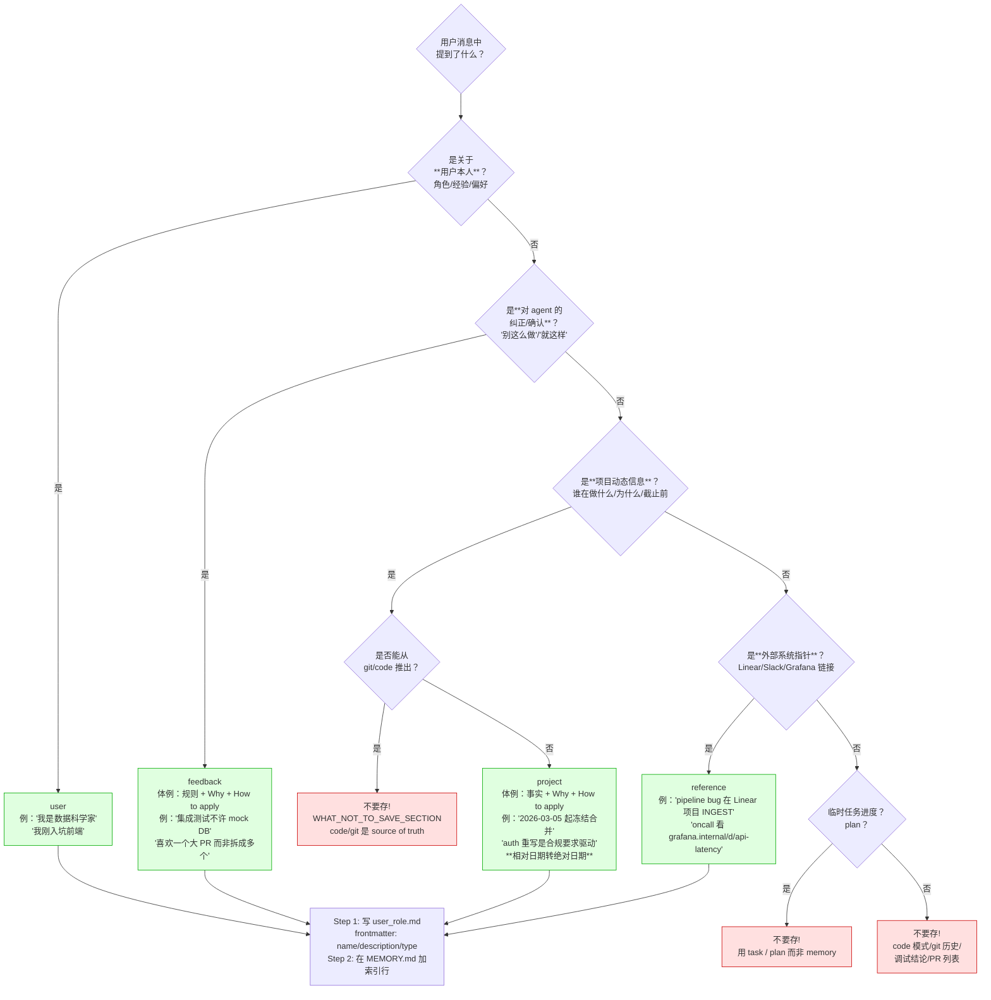

# 记忆与上下文（Memory & Context）

> **agent 学习核心**：mycli 的"记得用户偏好"、"记得项目约束"、"开新会话仍知上下文"——全部在这里实现。本章是上一篇 query/agent loop 的延伸：query 看到的 messages 数组并不只是用户输入，而是被多个层级的"记忆/上下文"模块在送往 LLM 前**主动拼接**的产物。

## 1. 模块作用

`mycli` 的"记忆"不是模型层的微调，而是一个 **prompt 工程层** 的多源汇聚：

| 来源 | 作用域 | 形式 | 注入位置 |
|------|--------|------|----------|
| **MEMORY.md / 单条 .md** (`src/memdir/`) | 项目级，跨会话 | 用户/agent 显式写入的"四类记忆" | system prompt 一段 + 单文件按需注入到 messages |
| **CLAUDE.md / MYCLI.md** (`src/utils/myclimd.ts`) | 仓库 + 父目录 + 全局 | 仓库里 checked-in 的指令文件 | `userContext.claudeMd` 字段 → `prependUserContext` 拼到 messages 头 |
| **Attachments** (`src/utils/attachments.ts`) | 单 turn / 跨 turn / 跨 compact | `Attachment` discriminated union 50+ 种 | 每个 turn `getAttachments()` 生成，`normalizeAttachmentForAPI` 渲染成 `<system-reminder>` 注入到 messages 中 |
| **Context** (`src/context.ts`) | 会话级，缓存一次 | `currentDate` + `claudeMd` + `gitStatus` | `prependUserContext` 在每次 query 拼到 messages 最前 |

四者**正交且叠加**：
- MEMORY.md 解决"agent 记住用户是谁、项目有什么约束"
- CLAUDE.md 解决"开发者把项目规则 checked-in 到代码库"
- attachments 解决"这一刻发生了什么"（todo 状态、plan 状态、被 @ 的文件、刚切换的日期…）
- context 解决"系统级常驻信息"（claudeMd、git status）

## 2. 关键文件与职责

| 文件 | 职责 |
|------|------|
| `src/memdir/memdir.ts` | 构建 `# auto memory` system prompt 段，包含 MEMORY.md 索引 + 四类记忆指南；提供 `loadMemoryPrompt` / `buildMemoryPrompt` |
| `src/memdir/memoryTypes.ts` | 四类记忆的分类指南（user / feedback / project / reference）和 frontmatter 模板，`MEMORY_TYPES` 常量 |
| `src/memdir/memoryScan.ts` | `scanMemoryFiles`：扫描记忆目录、读取 frontmatter、按 mtime 排序，产出 `MemoryHeader[]`（最多 200 条） |
| `src/memdir/findRelevantMemories.ts` | 启动/turn 时按用户 query 用 sub-Sonnet 调用挑出最相关的最多 5 条记忆 |
| `src/memdir/paths.ts` | `getAutoMemPath()` 解析记忆目录（默认 `~/.mycli/projects/<sanitized-git-root>/memory/`），含 worktree 收敛、env 覆盖、安全检查 |
| `src/memdir/memoryAge.ts` | 计算"saved 3 days ago" header；只在 attachment 创建时算一次（避免 prompt cache 失效） |
| `src/utils/myclimd.ts` | CLAUDE.md / MYCLI.md 多层加载（Managed/User/Project/Local + .mycli/rules + AutoMem），@include 指令、嵌套规则 |
| `src/utils/attachments.ts` | `Attachment` 类型联合（~50 种）+ `getAttachments` 收集器；最大单文件 |
| `src/utils/messages.ts` | `normalizeAttachmentForAPI`：把 `Attachment` 渲染成 `UserMessage[]` 并包 `<system-reminder>`；`reorderAttachmentsForAPI`：把附件冒泡到下一个 stopping point 之后 |
| `src/context.ts` | `getUserContext()` / `getSystemContext()`：每会话 memoize，组装 claudeMd + currentDate + gitStatus |
| `src/utils/api.ts` | `prependUserContext` 把 context 包成单条 `<system-reminder>` UserMessage 拼到 messages 最前 |

## 3. 执行步骤（带 file:line 引用）

### 3.1 启动期：装载 MEMORY 系统提示词

1. `loadMemoryPrompt()` `src/memdir/memdir.ts:419` 在 system prompt 构建阶段被调用。
2. 解析记忆目录开关：`isAutoMemoryEnabled()` `src/memdir/paths.ts:30` 读 env `CLAUDE_CODE_DISABLE_AUTO_MEMORY`、`autoMemoryEnabled` 设置。
3. 路径解析：`getAutoMemPath()` `src/memdir/paths.ts:223`：
   - 优先 `CLAUDE_COWORK_MEMORY_PATH_OVERRIDE`
   - 否则 `autoMemoryDirectory` setting（policy/local/user，**不**接受 projectSettings——因为仓库可能恶意指向 `~/.ssh`）
   - 默认 `<homedir>/.mycli/projects/<sanitizePath(git-root)>/memory/`
4. `ensureMemoryDirExists` `src/memdir/memdir.ts:129` 幂等创建目录。
5. `buildMemoryLines` `src/memdir/memdir.ts:199` 拼接：
   - 标题 `# auto memory`
   - 四类记忆 `TYPES_SECTION_INDIVIDUAL` `src/memdir/memoryTypes.ts:113`
   - "什么不要存" `WHAT_NOT_TO_SAVE_SECTION` `src/memdir/memoryTypes.ts:183`
   - "如何保存" 两步流程：写 `<file>.md` + 在 MEMORY.md 加索引行
   - MEMORY.md 内容（被 `truncateEntrypointContent` `src/memdir/memdir.ts:57` 限制到 200 行 / 25KB）
6. 这段文本作为 system prompt 一节，所有 turn 共享、走 prompt cache。

### 3.2 用户输入期：挑选相关记忆 + 收集 attachments

每个 turn，`query.ts` 调 `getAttachments()` `src/utils/attachments.ts:762` 之前先做一次 prefetch：

1. **`startRelevantMemoryPrefetch`**（在 `attachments.ts` 中由 query 层异步触发；正文路径走 `getRelevantMemoryAttachments` `src/utils/attachments.ts:2215`）
2. `findRelevantMemories(query, dir, signal, recentTools, alreadySurfaced)` `src/memdir/findRelevantMemories.ts:39`：
   - `scanMemoryFiles` 读 frontmatter（最多 200 条，按 mtime newest-first）`src/memdir/memoryScan.ts:35`
   - 过滤掉 `alreadySurfaced`（前几个 turn 已经注入的文件）
   - 拼 manifest 文本（`[type] filename (mtime): description`）
   - 用 `sideQuery` 调 **default Sonnet model**（不是主 model）`findRelevantMemories.ts:98`，system prompt 是 `SELECT_MEMORIES_SYSTEM_PROMPT`，结构化输出 schema 强制返回 `selected_memories: string[]`，最多 5 条
   - `recentTools`：Sonnet 看到这些工具最近被用过时，**不会**选这些工具的"使用文档"型记忆（避免噪音），但**仍会**选"陷阱/已知问题"型记忆
3. `readMemoriesForSurfacing` 真正读取选中的 5 条文件内容（截断长文件）。
4. 返回 `{ type: 'relevant_memories', memories: [{ path, content, mtimeMs, header }] }` `src/utils/attachments.ts:2260`。
5. 汇入 `getAttachments()` 主收集列表，与其他 attachment 类型（plan_mode、todo、@-mentioned files…）一同返回。

### 3.3 渲染期：把 attachment 变成 system-reminder

1. `normalizeAttachmentForAPI(attachment)` `src/utils/messages.ts:3453` 是巨大 switch 分发器。
2. 每个 case 把对应的结构化数据格式化成文字，再过 `wrapMessagesInSystemReminder` `src/utils/messages.ts:3101` —— 把内容包成 `<system-reminder>...</system-reminder>` 标签的 `UserMessage`，标记 `isMeta: true`（让 UI 知道这不是真用户说的）。
3. 关键 case 看 `messages.ts`：
   - `relevant_memories` (line 3737)：每条记忆 → `${header}\n\n${content}`
   - `nested_memory` (line 3729)：`Contents of ${path}:\n\n${content}`
   - `todo_restore` (line 3700)：把 V1/V2 任务列表写成 system-reminder，告诉模型"这些任务已经存在，别重建"
   - `invoked_skills` (line 3644)：把已调用 skill 的 SKILL.md 内容打包重注入
   - `plan_mode` / `plan_mode_reentry` / `plan_mode_exit` (line 3855+)：plan 状态切换提醒
   - `date_change`、`deferred_tools_delta`、`agent_listing_delta` 等 delta 类：跨 turn 增量提醒
4. `reorderAttachmentsForAPI` `src/utils/messages.ts:1481`：把所有 attachment 消息**冒泡**到下一个 "stopping point"（assistant 消息或 tool_result 块）之后，确保附件不会卡在 tool_use / tool_result 中间破坏 API 协议。

### 3.4 CLAUDE.md / MYCLI.md 多级加载

文件头注释 `src/utils/myclimd.ts:1-26` 给了定义性顺序。代码在 `getMemoryFiles` `src/utils/myclimd.ts:790`：

1. **Managed**（policy 强制）：`getMemoryPath('Managed')` + `~/.../rules/*.md`
2. **User**（用户全局）：`~/.mycli/MYCLI.md` + `~/.mycli/rules/*.md`，受 `userSettings` 设置源开关控制
3. **Project + Local**（仓库走查）：从 `originalCwd` 沿 `dirname` 走到根，**反向**push 进去保证"接近 cwd 的优先级最高、loaded 最晚"。每层尝试：
   - `MYCLI.md`（Project，checked-in，受 `projectSettings` 开关）
   - `.mycli/MYCLI.md`（Project）
   - `.mycli/rules/*.md`（Project，每个规则文件独立）
   - `MYCLI.local.md`（Local，gitignored，受 `localSettings` 开关）
4. nested worktree 收敛 `myclimd.ts:868`：当处于 `.mycli/worktrees/<name>/` 时，跳过 worktree 之外但 canonical-root 之内的 Project 文件，避免重复加载。
5. **AutoMem**：`getAutoMemEntrypoint()` 读 `MEMORY.md` 内容塞进同一个文件列表 `myclimd.ts:980+`。
6. `--add-dir` 触发的额外目录：仅在 env `CLAUDE_CODE_ADDITIONAL_DIRECTORIES_CLAUDE_MD` truthy 时再走一遍 Project 加载。
7. `getClaudeMds(memoryFiles, filter?)` `src/utils/myclimd.ts:1153`：把每个文件包装成 `Contents of <path> (<description>):\n\n<content>`，多个用 `\n\n` 拼接，前缀 `MEMORY_INSTRUCTION_PROMPT` "Codebase and user instructions are shown below..."。
8. `filterInjectedMemoryFiles` `src/utils/myclimd.ts:1142`：当 GrowthBook flag `tengu_moth_copse` 为 true 时，过滤掉 AutoMem/TeamMem（避免重复注入，因为另一条路径已经 inject）。

### 3.5 跨 turn 信息汇入：`prependUserContext`

1. 启动早期 `main.tsx` 触发 `getSystemContext()` / `getUserContext()` `src/main.tsx:367,405`，**预热**缓存（防止首 turn 卡在 fs.readFile 上）。
2. `getUserContext()` `src/context.ts:155`：
   - 检查 `CLAUDE_CODE_DISABLE_CLAUDE_MDS` 和 `--bare`
   - `getMemoryFiles()` → `filterInjectedMemoryFiles` → `getClaudeMds`
   - `setCachedClaudeMdContent` 给 yoloClassifier 用（避免循环依赖）
   - 返回 `{ claudeMd, currentDate: "Today's date is YYYY-MM-DD" }`
3. `getSystemContext()` `src/context.ts:116`：返回 `{ gitStatus }`（可选）+ ant-only `cacheBreaker`。
4. 每次 query.ts 主循环：
   - `prependUserContext(messagesForQuery, userContext)` `src/query.ts:660`
   - 实现 `src/utils/api.ts:449`：构造一条 `UserMessage`，content 为：
     ```
     <system-reminder>
     As you answer the user's questions, you can use the following context:
     # claudeMd
     <full claude.md content>
     # currentDate
     Today's date is 2026-04-24.
     IMPORTANT: this context may or may not be relevant ...
     </system-reminder>
     ```
   - 这条消息**总是**在 messages 数组最前。
5. `appendSystemContext` `src/utils/api.ts:437`：把 systemContext（gitStatus）作为额外的 system prompt 段拼到 system prompt 末尾。

## 4. 流程图

### 4.1 信息流向汇聚图

```mermaid
flowchart TB
    User[用户输入<br/>query string] --> Att[getAttachments<br/>attachments.ts:762]
    Code[(源代码<br/>仓库目录树)] --> Cmd[getMemoryFiles<br/>myclimd.ts:790]
    MemDir[(~/.mycli/projects/&lt;repo&gt;/<br/>memory/&#42;.md<br/>+ MEMORY.md)] --> Scan[scanMemoryFiles<br/>memoryScan.ts:35]
    MemDir --> AutoEntry[getAutoMemEntrypoint<br/>读 MEMORY.md]
    Git[(git: status / log / branch)] --> Sys[getSystemContext<br/>context.ts:116]

    Cmd --> ClaudeMd[getClaudeMds<br/>myclimd.ts:1153]
    AutoEntry --> Cmd
    ClaudeMd --> UserCtx[getUserContext<br/>context.ts:155<br/>memoize 一次]

    User -.query.- Sel[findRelevantMemories<br/>findRelevantMemories.ts:39<br/>子 Sonnet 调用<br/>挑最多 5 条]
    Scan --> Sel
    Sel --> RM[Attachment<br/>relevant_memories]
    RM --> Att

    IDE[IDE 选区 / 编辑事件] --> Att
    Plan[Plan/Auto/Skill 状态] --> Att
    Todo[V1 AppState<br/>V2 ~/.mycli/tasks/] --> Att

    Att --> Norm[normalizeAttachmentForAPI<br/>messages.ts:3453]
    Norm --> Wrap[wrapMessagesInSystemReminder<br/>messages.ts:3101]
    Wrap --> SysRem["每条 attachment<br/>变成 &lt;system-reminder&gt;<br/>UserMessage 流"]

    UserCtx --> Pre[prependUserContext<br/>api.ts:449]
    Sys --> AppSys[appendSystemContext<br/>api.ts:437]

    SysRem --> Reorder[reorderAttachmentsForAPI<br/>messages.ts:1481<br/>冒泡到 stopping point]
    Reorder --> Msgs[messages 数组]
    Pre --> Msgs

    Msgs --> Q[query.ts<br/>送往 LLM]
    AppSys --> Q

    MemPrompt[loadMemoryPrompt<br/>memdir.ts:419] --> SysPrompt[(system prompt<br/>含四类记忆指南<br/>+ MEMORY.md 索引)]
    SysPrompt --> Q
```



### 4.2 四类记忆分类决策图



四类的代码定义在 `MEMORY_TYPES = ['user', 'feedback', 'project', 'reference']` `src/memdir/memoryTypes.ts:14`。INDIVIDUAL 模式（默认 mycli）和 COMBINED 模式（启 TEAMMEM 时，每条加 `<scope>private|team</scope>`）的指南文本分别在 `TYPES_SECTION_INDIVIDUAL` `memoryTypes.ts:113` 和 `TYPES_SECTION_COMBINED` `memoryTypes.ts:37`。

## 5. 与其他模块的交互

- **query.ts / QueryEngine.ts**：每个 turn 调 `prependUserContext`、调 `getAttachments`、把 attachment 渲染消息插入 messages 数组。compact/resume 之后 `getAttachments` 仍在每 turn 跑（生成 todo_reminder、deferred_tools_delta 这类 delta 提醒）。
- **compact (`src/services/compact/`)**：详见 [06-compaction-and-resume.md](./06-compaction-and-resume.md)。compact 时主动重建 `relevant_memories` 之外的 attachments（plan、skill、todo、async agents），把状态再跨 boundary 推一遍。compact 触发时会重置 `nested_memory` 缓存 (`context.loadedNestedMemoryPaths.clear()`)，让 `relevant_memories` 在 compact 之后可以再次 surface 已 surface 过的文件 `src/utils/attachments.ts:2266` 注释。
- **skills (`src/skills/`)**：被 invoked 的 skill 会被记录到 `getInvokedSkillsForAgent`，`createSkillAttachmentIfNeeded` `src/services/compact/compact.ts:1521` 在 compact 时把这些 skill 重注入。
- **tools (TodoWrite / TaskCreate / TaskUpdate)**：写入 V1 AppState 或 V2 `~/.mycli/tasks/<taskListId>/<id>.json`，compact / resume 时通过 `createTodoRestoreAttachmentIfNeeded` 重注入。
- **filesystem permissions**：`isAutoMemPath` `src/memdir/paths.ts:274` 让 FileWriteTool 的写入 carve-out 识别记忆目录，**不**走危险目录拦截（除非 `hasAutoMemPathOverride`）。
- **GrowthBook flags**：`tengu_moth_copse`（跳过 AutoMem 索引）、`tengu_paper_halyard`（跳过 Project/Local）、`tengu_coral_fern`（追加"Searching past context"段）、`tengu_passport_quail`（启用 extract-memories 后台 agent）。
- **KAIROS feature**：长时会话改用 daily log 模式 `buildAssistantDailyLogPrompt` `src/memdir/memdir.ts:327` —— 不再实时维护 MEMORY.md，而是 append 到 `logs/YYYY/MM/YYYY-MM-DD.md`，由夜间 `/dream` skill 批量蒸馏。

## 6. 关键学习要点

1. **system prompt 段 vs messages 段**：MEMORY.md 的"如何保存/四类指南"在 system prompt（一次 caching），而**单条记忆内容**通过 attachment 注入 messages（按需 + 跨 turn de-dup）。两条路径**互不替代**：system 段告诉模型"你能保存什么"，messages 段告诉模型"现在记起了什么"。
2. **`<system-reminder>` 标签是约定俗成的注入语法**：`wrapInSystemReminder` `src/utils/messages.ts:3097` 把内容包进 `<system-reminder>...</system-reminder>`，模型被训练成识别这是来自系统而非用户。代码里**所有** attachment 几乎都走这个 wrap，唯一例外是 file 内容直接当 tool_result 注入。
3. **挑记忆是 LLM 决策，不是关键词**：`findRelevantMemories` 用一个独立 Sonnet 调用读 frontmatter manifest 决定哪 5 条相关。这是 LLM-as-router 模式，省 token、避免错配（如关键词命中工具引用却不该注入）。
4. **prompt cache 稳定性是头等设计目标**：`memoryAge` 的 header 在 attachment 创建时**算一次**就存住（`relevant_memories.memories[i].header` 字段）`src/utils/attachments.ts:524-533` 注释——如果每 turn 重算 `Date.now()`，"saved 3 days ago" → "saved 4 days ago" 会让 prompt cache 失效。同理 `truncateEntrypointContent`、`getAutoMemPath` 都是 memoize/确定性的。
5. **CLAUDE.md 的层级是"反向 push、loaded 越晚优先级越高"**：从 cwd 沿父目录上行收集，再 `dirs.reverse()` 从 root 往 cwd 拼接。模型默认对**最后**出现的指令更敏感，所以 cwd 的 MYCLI.md 比仓库根的 MYCLI.md 优先级高。
6. **autoMemoryDirectory 安全**：`getAutoMemPathSetting` `src/memdir/paths.ts:179` **故意不读** `projectSettings`（仓库里 commit 的设置）——否则恶意仓库可以把记忆目录指到 `~/.ssh` 利用 filesystem write carve-out 写文件。

## 7. 延伸阅读

- 上一篇 [04-tools-and-skills.md] 讲工具和 skills 注册——本章的 attachment dispatcher 是工具调用的"前驱"，工具的输出又会触发新的 attachment（如 IDE 选区变化、@-mention 文件）。
- 下一篇 [06-compaction-and-resume.md](./06-compaction-and-resume.md) 讲压缩 / 恢复——把本章的所有"现在记得"机制再做一次跨 boundary 重注入，是验证理解的最好关联章节。
- 关键文件直读：
  - `src/memdir/memoryTypes.ts:1-200`：四类记忆完整指南文本（这就是模型读到的"如何记忆"教材）
  - `src/utils/messages.ts:3453-4100`：`normalizeAttachmentForAPI` 的 ~50 个 case，是了解"agent 在每 turn 看到什么 system reminder"的最直接入口
  - `src/utils/attachments.ts:440-737`：`Attachment` 联合类型的全集——一眼看到 mycli 把哪些"上下文片段"做成显式数据
