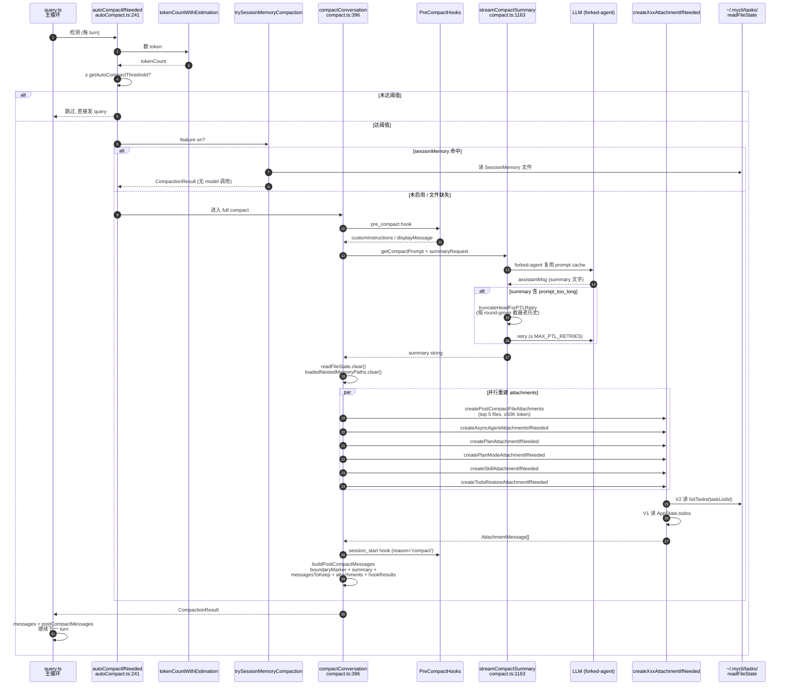

# 压缩与恢复（Compaction & Resume）

> 上一篇 [05-memory-and-context.md](./05-memory-and-context.md) 讲了"agent 在每 turn 怎么把上下文拼起来"。本章是**长会话的下半场**：当 messages 数组逼近 model 的 context window 上限时，mycli 怎么"忘掉一部分历史，又不丢任务"；当用户重启进程后，怎么把"任务/计划/文件状态"重新拼回去。

## 1. 模块作用

`mycli` 把上下文管理拆成两类机制：

| 机制 | 何时触发 | 目标 |
|------|----------|------|
| **Auto-compact** | tokenCount 接近 effective context window | 让模型把老历史**摘要成一段文字**，让 messages 数组变短 |
| **Manual /compact** | 用户主动触发 | 同上，可加 `customInstructions` |
| **Partial compact** | 用户在某条消息上选 `compact up_to` / `compact from` | 仅压缩选定段 |
| **Session memory compact**（实验） | GrowthBook 双 flag 启 | 用后台维护的 SessionMemory 文件**代替**临场摘要 |
| **Resume** | `--continue` / `--resume` / `/resume` | 把 transcript jsonl 加载回来，重建 V1/V2 任务、文件历史、worktree、attribution 等 |

无论哪条路径，**核心难点都一样**：模型的"看见"全靠 messages 数组里的 tool_use/tool_result 序列，但 compact 会丢弃它们；任务（V1 AppState、V2 文件）虽然**实际状态没丢**，模型却"忘了它存在"——直到 ~10 个 turn 后 todo_reminder 才再提醒一次。`createTodoRestoreAttachmentIfNeeded` 等系列函数就是用来**关上这个 10 turn 的失忆窗口**。

## 2. 关键文件与职责

| 文件 | 职责 |
|------|------|
| `src/services/compact/compact.ts` | 核心。`compactConversation`（full）、`partialCompactConversation`、`createTodoRestoreAttachmentIfNeeded`、`createSkillAttachmentIfNeeded`、`createPlanAttachmentIfNeeded`、`createPlanModeAttachmentIfNeeded`、`createPostCompactFileAttachments` |
| `src/services/compact/autoCompact.ts` | `shouldAutoCompact` 阈值检测、`getAutoCompactThreshold`、`autoCompactIfNeeded`（query.ts 调用入口）、effective context window 计算 |
| `src/services/compact/sessionMemoryCompact.ts` | 实验路径：用预先维护的 SessionMemory 文件代替临场 summary（`trySessionMemoryCompaction`） |
| `src/services/compact/microCompact.ts` | 小幅压缩工具结果（在不触发完整 compact 时使用） |
| `src/services/compact/prompt.ts` | `getCompactPrompt` / `getPartialCompactPrompt` / `getCompactUserSummaryMessage`：让模型输出/接收 summary 的提示词模板 |
| `src/services/compact/postCompactCleanup.ts` | compact 后的二次清理（清 cache、reset 子系统状态） |
| `src/services/compact/grouping.ts` | 把 tool_use+tool_result 配对成 round group，PTL 重试时按 group 截断 |
| `src/utils/sessionRestore.ts` | resume 入口：`restoreSessionStateFromLog`（异步）、`extractTodosFromTranscript`、`processResumedConversation`、`restoreWorktreeForResume` |
| `src/utils/tasks.ts` | V2 任务存储：`isTodoV2Enabled`（非交互或显式 env）、`listTasks`、`getTasksDir`（`~/.mycli/tasks/<taskListId>/<id>.json`） |
| `src/utils/fileHistory.ts` | 文件编辑快照：`fileHistoryRestoreStateFromLog` |
| `src/utils/commitAttribution.ts` | commit 归属（COMMIT_ATTRIBUTION feature）：`attributionRestoreStateFromLog` |

## 3. 执行步骤

### 3.1 触发：`shouldAutoCompact`

`autoCompactIfNeeded` `src/services/compact/autoCompact.ts:241` 在 query.ts 主循环每个 turn 之前评估：

1. **门控**：
   - `querySource === 'session_memory' | 'compact' | 'marble_origami'` → 直接跳（递归保护）`autoCompact.ts:171`
   - `isAutoCompactEnabled()` 检查 `DISABLE_COMPACT` / `DISABLE_AUTO_COMPACT` env、`autoCompactEnabled` 全局设置 `autoCompact.ts:147`
   - REACTIVE_COMPACT、CONTEXT_COLLAPSE 启用时主动让位
2. **阈值计算** `getAutoCompactThreshold` `autoCompact.ts:72`：
   - `effectiveContextWindowSize` = `contextWindow(model) - max(20_000, maxOutputTokensForModel)` —— 留 ~20K token 给 summary 输出 `autoCompact.ts:33`
   - 阈值 = effective - `AUTOCOMPACT_BUFFER_TOKENS (13_000)` `autoCompact.ts:62`
   - 支持 `CLAUDE_AUTOCOMPACT_PCT_OVERRIDE` env 强制百分比
3. `tokenCountWithEstimation(messages)` 数 token，超阈值 → 返回 true → `compactConversation` 起飞。
4. 失败 3 次（`MAX_CONSECUTIVE_AUTOCOMPACT_FAILURES = 3`）后熔断 `autoCompact.ts:70`，避免 1,279 个 session 50+ 次失败浪费 250K API 调用/天的回归（注释里给了 BQ 数据）。

### 3.2 Full compact：`compactConversation`

`src/services/compact/compact.ts:396`，主流程：

1. **执行 PreCompact hooks** (`compact.ts:422`)：用户可注册 hook 修改 customInstructions 或显示自定义消息。
2. **生成 summary**（`streamCompactSummary` `compact.ts:1163`）：
   - 用 `getCompactPrompt(customInstructions)` 拼一段 user 消息让模型输出 summary
   - 优先走 **forked-agent 路径**（GrowthBook `tengu_compact_cache_prefix` 默认 true）：`runForkedAgent` 复用主对话的 prompt cache 前缀（system + tools + 历史）`compact.ts:1215`
   - 失败回退到普通 streaming 路径
   - 如果 summary 返回 `prompt_too_long`：`truncateHeadForPTLRetry` 按 round-group 截掉最老的 tool 调用对，retry 最多 `MAX_PTL_RETRIES` 次 `compact.ts:472`
3. **清缓存**：`context.readFileState.clear()`、`context.loadedNestedMemoryPaths?.clear()` `compact.ts:530`。注释明确**不**重置 `sentSkillNames`——避免重注入 4K token 的 skill_listing。
4. **重新生成 attachments**（这一步是本章最核心的"防失忆"）：
   - `createPostCompactFileAttachments` `compact.ts:1442`：把 compact 前 readFileState 中的关键文件（最多 5 个，每个 ≤5K token，总预算 50K）重新读一次注入
   - `createAsyncAgentAttachmentsIfNeeded` `compact.ts:1636`：把仍在跑的 LocalAgentTask / 已结束未取回的 agent 写成 `task_status` attachment（防止模型 spawn 重复 agent）
   - `createPlanAttachmentIfNeeded` `compact.ts:1497`：当前 plan 文件内容
   - `createPlanModeAttachmentIfNeeded` `compact.ts:1610`：如果当前在 plan mode，注入完整 plan_mode 指令
   - `createSkillAttachmentIfNeeded` `compact.ts:1521`：所有这次会话调用过的 skill 的 SKILL.md 内容（按 invokedAt 倒序，每个 ≤5K token，总预算 25K）
   - **`createTodoRestoreAttachmentIfNeeded`** `compact.ts:1578`：见 §3.4
   - `getDeferredToolsDeltaAttachment` / `getAgentListingDeltaAttachment` / `getMcpInstructionsDeltaAttachment`：以"空消息历史 vs 当前工具/agent/MCP 集合"做 diff，重新发 delta 通告
5. **执行 SessionStart hooks（reason: compact）** `compact.ts:610`：让用户 hook 决定是否在 compact 后注入额外消息。
6. **构造 boundaryMarker** `compact.ts:616`：一条 system 消息 `compact_boundary` 类型，记录 `preCompactTokenCount`、`preCompactDiscoveredTools`，后续 transcript 里这是"压缩点"标记。
7. 返回 `CompactionResult { boundaryMarker, summaryMessages, attachments, hookResults, preCompactTokenCount, postCompactTokenCount, ... }`。
8. 调用方（query.ts）通过 `buildPostCompactMessages` `compact.ts:339` 拼：
   ```
   [boundaryMarker, ...summaryMessages, ...messagesToKeep ?? [], ...attachments, ...hookResults]
   ```
   作为新的 messages 数组继续往下跑。

### 3.3 Partial compact：`partialCompactConversation`

`compact.ts:790`，相比 full 多了一个 `pivotIndex` 和 `direction`：

- `direction === 'up_to'`：摘要 `[0, pivot)`，保留 `[pivot, end]`
- `direction === 'from'`：摘要 `[pivot, end]`，保留 `[0, pivot)`

特殊处理 `messagesToKeep` `compact.ts:808`：`up_to` 必须**剥掉旧的 compact boundary 和 isCompactSummary 消息**——否则旧 boundary 会赢得 `findLastCompactBoundaryIndex` 的反扫，让新 summary 失效。

`createPostCompactFileAttachments` 在 partial 路径多传一个 `messagesToKeep` 参数，让 delta 类 attachment 只重发"被丢掉那段"的差量（`callSite: 'compact_partial'`）`compact.ts:984+`。

### 3.4 任务保留：`createTodoRestoreAttachmentIfNeeded`

`compact.ts:1578` 这里是 V1/V2 双轨制的**唯一汇合点**：

```typescript
if (isTodoV2Enabled()) {
  const tasks = await listTasks(getTaskListId())
  if (tasks.length === 0) return null
  return createAttachmentMessage({ type: 'todo_restore', source: 'v2', tasks, itemCount })
}
if (!getAppState) return null   // V2 失败时直接 return null，**不**回退到 V1
const todoKey = agentId ?? getSessionId()
const todos = getAppState().todos?.[todoKey] ?? []
if (todos.length === 0) return null
return createAttachmentMessage({ type: 'todo_restore', source: 'v1', todos, itemCount })
```

- **V1（TodoWrite）**：`AppState.todos[sessionId]` 数组，进程内内存。SDK / 非交互 session 走这条路（`isTodoV2Enabled()` `tasks.ts:133` 在 `getIsNonInteractiveSession()` 时返回 false）。
- **V2（TaskCreate / TaskUpdate）**：磁盘文件 `~/.mycli/tasks/<sanitizePathComponent(taskListId)>/<id>.json` `tasks.ts:221`。`taskListId` 解析顺序：`CLAUDE_CODE_TASK_LIST_ID` env → 团队 leader 的 teamName → leaderTeamName → sessionId `tasks.ts:199`。
- **决策点**：`isTodoV2Enabled()` 的实现非常简单——非交互 → V1，交互 → V2，可被 `CLAUDE_CODE_ENABLE_TASKS` env 强开。
- **边界**：当 V2 启用但 `getAppState === null`（例如 sessionMemoryCompact 路径），V2 path 仍然能跑（直接读磁盘）；但当 V1 启用而 `getAppState === null`，**当前实现直接 return null**——V1 任务在该路径下会丢失重注入机会。注释 `compact.ts:1573-1577` 明确承认了这个 trade-off。

渲染端 `messages.ts:3700`：
- V2：`"The task list below was active before the last compaction and is still live on disk. Do NOT recreate these tasks..."`
- V1：`"The todo list below was active before the last compaction and is still live in session state. Do NOT recreate..."`

两条都包 `<system-reminder>`。

### 3.5 SessionMemory compact（实验路径）

`src/services/compact/sessionMemoryCompact.ts:524` `trySessionMemoryCompaction`：

1. 双 flag 门控 `shouldUseSessionMemoryCompaction` `sessionMemoryCompact.ts:404`：`tengu_session_memory && tengu_sm_compact`，否则返回 null（让 autoCompact 走老路）。
2. `waitForSessionMemoryExtraction` 等后台抽取完成。
3. 读 `getSessionMemoryContent()`（一份后台维护的"项目状态"文件）和 `getLastSummarizedMessageId()`。
4. 决定 `messagesToKeep`：
   - 有 `lastSummarizedMessageId` → keep `[lastSummarizedIndex+1, end]`
   - 没有（resumed session）→ keep 末尾若干条满足 `minTextBlockMessages: 5` / `minTokens: 10K` / `maxTokens: 40K`（`DEFAULT_SM_COMPACT_CONFIG` `sessionMemoryCompact.ts:58`）
5. **不调 model 生成 summary**——直接用 SessionMemory 文件内容当 summary：
   ```typescript
   const summaryContent = getCompactUserSummaryMessage(truncatedContent, true, transcriptPath, true)
   ```
6. 重注入只做 plan 和 todo（**不**做 file/skill/asyncAgent/delta，因为路径上没 ToolUseContext）`sessionMemoryCompact.ts:485`：
   ```typescript
   const todoRestoreAttachment = await createTodoRestoreAttachmentIfNeeded(agentId, null)
   //                                                                              ^ V1 跳过
   ```
7. 返回的 `CompactionResult.preCompactTokenCount` 和 `postCompactTokenCount` 用 `estimateMessageTokens` 估，没有真正的"compact API 调用"开销。

这是一种**预先持续维护**的设计：让另一个 background 子 agent 每隔几个 turn 把"项目状态"萃取到一个文件，compact 直接复用，避免每次都付一次 model 调用。

### 3.6 Resume 路径：`restoreSessionStateFromLog`

`src/utils/sessionRestore.ts:107`，**异步**签名（早期版本是 sync）：

1. **fileHistory** 重建：`fileHistoryRestoreStateFromLog(snapshots, setAppState)` `sessionRestore.ts:113`——重放 transcript 中的文件编辑快照，让 `--undo` 之类工具仍可用。
2. **attribution** 重建（feature `COMMIT_ATTRIBUTION`）：`attributionRestoreStateFromLog`。
3. **context-collapse** 重建（feature `CONTEXT_COLLAPSE`）：`restoreFromEntries` `sessionRestore.ts:138`。**无条件调用**（即使 entries 为空），因为函数内部会先 reset 状态——否则中途 `/resume` 会留下旧 session 的脏 commit log。
4. **V1 todos 提取**：仅当 `!isTodoV2Enabled()` 时，扫 transcript 找最后一个 `TodoWrite` 的 tool_use，解析 `input.todos` 写回 `AppState.todos[sessionId]`：

   ```typescript
   function extractTodosFromTranscript(messages: Message[]): TodoList {
     for (let i = messages.length - 1; i >= 0; i--) {
       const msg = messages[i]
       if (msg?.type !== 'assistant') continue
       const toolUse = msg.message.content.find(b => b.type === 'tool_use' && b.name === TODO_WRITE_TOOL_NAME)
       if (!toolUse) continue
       const parsed = TodoListSchema().safeParse((toolUse.input as Record<string, unknown>).todos)
       return parsed.success ? parsed.data : []
     }
     return []
   }
   ```
   `sessionRestore.ts:78`

5. **构造 V1 accessor 并调 `createTodoRestoreAttachmentIfNeeded`** `sessionRestore.ts:167`：
   ```typescript
   const v1Accessor = restoredV1Todos && restoredV1AgentId
     ? () => ({ todos: { [restoredV1AgentId]: restoredV1Todos } })
     : null
   return createTodoRestoreAttachmentIfNeeded(undefined, v1Accessor)
   ```
   注释解释为什么不直接读 AppState：`setAppState` 是 async-queued 的，立即读会和上面的 set 竞态，所以这里**闭包刚提取的 todos**。

6. CLI `--continue` / `--resume` 走另一个入口 `processResumedConversation` `sessionRestore.ts:431`，最后也调 `createTodoRestoreAttachmentIfNeeded(undefined, null)`——只走 V2 path（V1 在该路径下不重建，因为 SDK/非交互不进这里）。

### 3.7 worktree 与 cwd 重建

`restoreWorktreeForResume` `sessionRestore.ts:354`：

- 优先级：fresh `--worktree` 创建 > 旧 transcript 记录
- `process.chdir` 兼做 ENOENT 探针——若目录被删，调 `saveWorktreeState(null)` 覆盖陈旧缓存
- 成功后清三个缓存：`clearMemoryFileCaches()`、`clearSystemPromptSections()`、`getPlansDirectory.cache.clear()` —— 因为 cwd 一变这些都是脏数据

## 4. 流程图

### 4.1 compact 触发与重注入序列



### 4.2 V1/V2 任务源切换状态图

```mermaid
stateDiagram-v2
    [*] --> CallSite: createTodoRestoreAttachmentIfNeeded<br/>(agentId, getAppState)

    CallSite --> CheckV2: isTodoV2Enabled()?
    note right of CheckV2
        非交互 session → V1
        交互 session → V2
        CLAUDE_CODE_ENABLE_TASKS=1 强开 V2
    end note

    CheckV2 --> V2Path: true
    CheckV2 --> V1Branch: false

    state V2Path {
        [*] --> ResolveListId: getTaskListId()
        ResolveListId --> ReadDisk: listTasks(taskListId)<br/>读 ~/.mycli/tasks/&lt;id&gt;/&#42;.json
        ReadDisk --> CheckEmpty
        CheckEmpty --> EmitV2: tasks.length > 0
        CheckEmpty --> ReturnNull: tasks.length === 0
        EmitV2: emit { type: todo_restore,<br/>source: v2, tasks }
    }

    state V1Branch {
        [*] --> CheckAccessor: getAppState !== null?
        CheckAccessor --> ReturnNullV1: null<br/>**当前实现：直接 return null**<br/>(不回退、不重试)
        CheckAccessor --> ReadAppState: 有
        ReadAppState --> CheckEmptyV1: AppState.todos[agentId ?? sessionId]
        CheckEmptyV1 --> EmitV1: todos.length > 0
        CheckEmptyV1 --> ReturnNullV1B: todos.length === 0
        EmitV1: emit { type: todo_restore,<br/>source: v1, todos }
    }

    EmitV2 --> [*]
    EmitV1 --> [*]
    ReturnNull --> [*]
    ReturnNullV1 --> [*]
    ReturnNullV1B --> [*]

    note left of V1Branch
        sessionMemoryCompact 调用时
        getAppState=null：
        - V2 仍工作（读盘）
        - V1 静默跳过（任务丢失重注入）
        这是已知边界，注释里
        compact.ts:1573-1577 明确承认
    end note
```



## 5. 与其他模块的交互

- **query.ts**：唯一直接调用 `autoCompactIfNeeded` 的地方；compact 后用 `buildPostCompactMessages` 替换 messages 数组继续 loop。
- **05-memory-and-context.md 涉及的 attachment 系统**：compact 后 attachments 被重新生成 + `<system-reminder>` 渲染 + `reorderAttachmentsForAPI` 冒泡——和正常 turn 同一条管道，唯一区别是它们一次性塞了好几条。
- **hooks 系统**：`PreCompact` / `SessionStart(reason='compact')` / `PostCompact` 三个 hook 点；用户脚本可以注入额外指令、显示给 UI 的消息、或截获 summary 后做处理。
- **prompt cache 系统**：forked-agent 路径靠 `cacheSafeParams.forkContextMessages` 复用主线程的 cache key；compact 之后调 `notifyCompaction` `compact.ts:716` 重置 prompt-cache-break 监测的基线，避免后续 turn 把 cache drop 误报成异常。
- **transcript / sessionStorage**：boundary marker 写入 jsonl，`reAppendSessionMetadata` 在 compact 后重新追加元数据让 `--resume` 列表能显示自定义会话名。
- **context-collapse 子系统**（feature `CONTEXT_COLLAPSE`）：另一种"忘掉历史"机制（按 commit 边界折叠），和 compact 互斥——`shouldAutoCompact` 检测到 collapse 启用时**主动让位**`autoCompact.ts:215`。
- **microCompact**（`src/services/compact/microCompact.ts`）：仅压缩单个超大 tool_result，不动 messages 结构，是 compact 的"微创"姊妹。

## 6. 关键学习要点

1. **compact ≠ 删历史，compact = 摘要 + 状态重广播**：summary 文字本身只能让模型"知道发生过"；让模型"知道现在还在跑什么"靠的是 6 类 attachment（file / asyncAgent / plan / planMode / skill / todoRestore）+ 3 类 delta（deferredTools / agentListing / mcpInstructions）。
2. **任务状态从不丢，但模型会失忆 ~10 turn**：V2 任务在磁盘、V1 在内存——compact 不动它们。问题是模型只通过 tool_use/tool_result 序列"看到"任务列表，summary 一压这些就消失了。`todo_reminder` 默认 ~10 个 turn 才再提醒一次（TODO_REMINDER_CONFIG），所以 `todo_restore` attachment 是"失忆窗口关闭器"。
3. **forked-agent 复用 prompt cache 是大杀器**：默认开启（`tengu_compact_cache_prefix=true`），实验数据 `compact.ts:441-443` 显示关闭后 98% cache miss、占了 0.76% 的 fleet cache_creation。compact summary 调用本身能命中主对话 cache，节省的是**入参** token 而非输出 token。
4. **PTL 重试按 round-group 截最老历史**：`truncateHeadForPTLRetry` 不是任意切，是按 `tool_use + tool_result` 配对组截。`grouping.ts` 维护这种语义边界，否则 retry 会切出"孤儿 tool_use"，API 直接 422。
5. **isTodoV2Enabled 的实现极简、近乎"凭直觉"**：`return !getIsNonInteractiveSession()` `tasks.ts:138`——交互 = V2，非交互 = V1。这意味着同一个 codebase 在 SDK 模式和 REPL 模式下任务系统**完全不同**，compact/resume 的代码路径也分叉。
6. **resume 时 V1/V2 走两条路**：交互 `--resume`（main.tsx）→ `processResumedConversation` → `createTodoRestoreAttachmentIfNeeded(undefined, null)`（仅 V2）；SDK `--resume`（print.ts）→ `restoreSessionStateFromLog` → 显式从 transcript 提 V1 todos 后构造 closure accessor 再调。这是因为 V1 在主进程内存里，要先把它"复活"到 AppState。
7. **`messagesToKeep` 在 partial compact 里有微妙的 boundary 处理**：`up_to` 必须**剥旧 boundary 和 isCompactSummary**，`from` 必须**保留**——因为 summary 在前还是在后决定了 `findLastCompactBoundaryIndex` 反扫的命中点 `compact.ts:803-807`。理解这点是看懂 partial compact 的钥匙。
8. **此处实现复杂、本文未深挖**：`extractDiscoveredToolNames` 与 `boundaryMarker.compactMetadata.preCompactDiscoveredTools` 的双工流转、`recordContentReplacement` 在 fork session 时的 token cache 接续、`ContextCollapse` 与 compact 的关系——都属于"知道有这条路径"层级，深入需要专门一篇。

## 7. 延伸阅读

- 上一篇 [05-memory-and-context.md](./05-memory-and-context.md)：本章重注入的 attachment 类型、`<system-reminder>` 包装、`reorderAttachmentsForAPI` 冒泡都在那里讲清楚了。
- 关键文件直读：
  - `src/services/compact/compact.ts:396-781`：`compactConversation` 全流程，每个步骤都有详细注释
  - `src/services/compact/compact.ts:1497-1660`：6 个 `createXxxAttachmentIfNeeded` 函数体，是了解"compact 重注入了什么"的最直接清单
  - `src/utils/sessionRestore.ts:107-172`：resume 的状态重建主体
  - `src/utils/tasks.ts:133-230`：V2 任务的存储路径与 taskListId 解析规则
- 相关源：`src/services/contextCollapse/`（另一种 context 管理机制，与 compact 互斥）；`src/services/SessionMemory/`（sessionMemoryCompact 的数据来源）。
