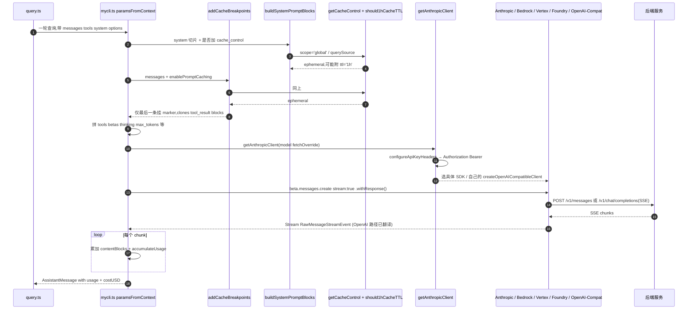

# 多 Provider 支持

## 1. 模块作用

mycli 支持把同一份 Anthropic 风格的对话发送到多种后端：官方 Anthropic API、AWS Bedrock / GCP Vertex / Azure Foundry 上的 Claude 转售、Anthropic-compatible 网关（Kimi、aigocode 等），以及 OpenAI Chat Completions 风格的网关（GitHub Models、GitHub Copilot、自托管 vLLM 等）。

抽象层次：

- **Anthropic SDK** 是上游协议。`@anthropic-ai/sdk` 的 `Anthropic` 类是统一接口，所有“原生”和“转售”后端都直接复用 SDK（Bedrock / Vertex / Foundry 各自有 `@anthropic-ai/bedrock-sdk` 等子包，但都实现 `beta.messages.create` 同款 API）。
- **OpenAI 兼容网关**则不能用上游 SDK。`src/services/api/openaiCompatibleClient.ts` 自己 fetch `POST /chat/completions`，把 Anthropic 入参 → OpenAI 出参，再把 OpenAI SSE 反向翻译成 Anthropic 的 `Stream<RawMessageStreamEvent>`，伪装成同一种类型回传。
- **`src/services/api/mycli.ts`** 是协议无关的“查询编排层”：拼 messages / tools / system / cache_control，加 beta header，调 retry，处理流式 chunk → `AssistantMessage`。它不直接写 fetch，全部经由 `getAnthropicClient()`。

Auth 在 fork 里被大幅精简——OAuth、macOS Keychain、`ANTHROPIC_API_KEY` env 自动发现都已删除，settings.json 是唯一来源（见 `CLAUDE.md`）。

## 2. 关键文件与职责

| 路径 | 职责 |
| --- | --- |
| `src/services/api/client.ts` | `getAnthropicClient()` 工厂：根据当前 provider type 创建 `Anthropic` / `AnthropicBedrock` / `AnthropicVertex` / `AnthropicFoundry` / `createOpenAICompatibleClient()`；统一注入 `defaultHeaders` 和 `Authorization: Bearer ...`。|
| `src/services/api/mycli.ts` | 主查询循环：`paramsFromContext` 拼请求体，`addCacheBreakpoints` 插 cache_control，`getCacheControl` / `should1hCacheTTL` 决定 ttl，`buildSystemPromptBlocks` 处理 system prompt 的缓存切片。|
| `src/services/api/openaiCompatibleClient.ts` | OpenAI Chat Completions 适配层：`anthropicMessagesToOpenAI`、`anthropicToolsToOpenAI`、`createOpenAIEventStream`（SSE → Anthropic 流式事件）、`buildHeaders`（GitHub-Copilot 等 provider 特有 header）。|
| `src/utils/settings/types.ts` | `ProviderTypeSchema`（zod 枚举），定义 8 种 provider type。|
| `src/utils/model/providers.ts` / `providerConfig.ts` | `getActiveProviderConfig()`、`getAPIProvider()`、`getConfiguredProviderApiKey()`、`isFirstPartyAnthropicBaseUrl()` 等 provider 状态查询。|
| `src/services/analytics/growthbook.ts` | `getFeatureValue_CACHED_MAY_BE_STALE`；`isGrowthBookEnabled()` 在 fork 里被硬编码为 `return false`（429-431 行），所有 GrowthBook 配置一律返回默认值。|

## 3. 执行步骤（带 file:line 引用）

### 3.1 Provider 类型与 settings 配置

`ProviderTypeSchema`（`src/utils/settings/types.ts:111-122`）一共 8 种：

| type | 客户端走向 | 备注 |
| --- | --- | --- |
| `firstParty` | `new Anthropic({...})` 直连 `api.anthropic.com` | 默认。`isFirstPartyAnthropicBaseUrl()` 用于 token 计算 / beta gating。|
| `bedrock` | `new AnthropicBedrock(...)` | 走 AWS SigV4，可用 `AWS_BEARER_TOKEN_BEDROCK` 跳过签名（`client.ts:212-227`）。|
| `vertex` | `new AnthropicVertex(...)` | 用 `google-auth-library`。`getVertexRegionForModel` 决定 region（`client.ts:332`）。|
| `foundry` | `new AnthropicFoundry(...)` | Azure。可走 `ANTHROPIC_FOUNDRY_API_KEY`，否则用 `DefaultAzureCredential`。|
| `anthropic-compatible` | `new Anthropic({ baseURL, apiKey })` | Kimi、aigocode 等 Anthropic-shaped 网关。fork 默认走这条配 Kimi。|
| `openai-compatible` | `createOpenAICompatibleClient` | 任意 vLLM / OpenAI 兼容端点。|
| `github-models` | 同上，但走 `getDefaultBaseUrl('github-models')` | 用 GitHub 的免费 inference 端点。|
| `github-copilot` | 同上，附特殊 Copilot header | token 解析顺序：env var → `GH_TOKEN` → `GITHUB_TOKEN` → `gh auth token`（见 `CLAUDE.md`）。|

settings.json 形态：
```json
{
  "providers": {
    "kimi": {
      "type": "anthropic-compatible",
      "baseURL": "https://api.moonshot.cn/anthropic/",
      "apiKey": "sk-..."
    }
  },
  "provider": "kimi",
  "model": "kimi-k2-0711-preview"
}
```

### 3.2 Auth header 注入

1. `getAnthropicClient` 拿到 `customHeaders`（来自 `ANTHROPIC_CUSTOM_HEADERS` 等），合成 `defaultHeaders`（`src/services/api/client.ts:125-150`）。
2. 非 Claude.ai 订阅用户走 `configureApiKeyHeaders`（`client.ts:362-376`）：
   - token 来源依次为 `getConfiguredProviderAuthToken()` → 当 provider 为 OpenAI 兼容时 `getConfiguredProviderApiKey()` → `getAnthropicApiKey()`；
   - 命中后写 `headers['Authorization'] = 'Bearer ' + token`。
3. `firstParty` 直连模式额外把 token 放进 SDK `clientConfig.apiKey`（`client.ts:343-345`），由 SDK 负责 `x-api-key` 头部；其他 OpenAI 兼容路径**只**用 `Authorization: Bearer ...`。
4. **fork 已删除**的 OAuth 通路：`checkAndRefreshOAuthTokenIfNeeded()`、Keychain 查询、自动从 env 读 `ANTHROPIC_API_KEY` 这条链路。`isClaudeAISubscriber()` 走的也是 settings.json 的标记位（详见 `CLAUDE.md`）。

### 3.3 请求体拼装（`mycli.ts:paramsFromContext`）

每次 retry 都会重新生成 params（`src/services/api/mycli.ts:1538-1729`）。组成：

- **`model`**：`normalizeModelStringForAPI(options.model)`。
- **`messages`**：`addCacheBreakpoints(messagesForAPI, ...)` 走 `userMessageToMessageParam` / `assistantMessageToMessageParam`，仅在最后一条消息上挂 `cache_control`（`mycli.ts:3078-3106`）。skipCacheWrite（fork 子任务）的话挂在倒数第二条。
- **`system`**：`buildSystemPromptBlocks` 把系统提示按 `splitSysPromptPrefix` 切成多段；可缓存的段尾各自挂 `cache_control`（`mycli.ts:3213-3237`）。
- **`tools`**：`allTools = [...toolSchemas, ...extraToolSchemas]`，工具 schema 数组的最后一项也会被加上 `cache_control`（标准 4-breakpoint 中的一个，作为 tool schema 边界）。
- **`betas`**：动态 beta header 列表，包含 `context-1m`、`structured-outputs`、`fast-mode`、`afk-mode`、`cache-editing`、`advisor` 等；每个有自己的 latch（如 `setFastModeHeaderLatched`）来保证 cache key 不抖动。
- **`thinking` / `temperature` / `output_config` / `context_management` / `speed`**：见 1599-1727 行，按模型与 effort 配置裁切。

### 3.4 cache_control 与 4 个 breakpoint

Anthropic API 对每个请求最多 4 个 `cache_control` 标记。fork 当前实际占位：

1. **System prompt**：可缓存的 prefix 段（`buildSystemPromptBlocks`）；可能 1~2 个 marker，分别对应 `scope='global'`（团队级 prefix）和 query-source 级 prefix。
2. **Tools 数组末尾**：在 `allTools` 最后一项的 schema 上加 `cache_control`，把整个工具表纳入缓存前缀。
3. **Messages**：`addCacheBreakpoints` 在最后一条消息（或倒数第二，见 skipCacheWrite）的最后一个 content block 上加 `cache_control`，作为对话尾部的缓存切点。

`getCacheControl({ scope, querySource })`（`mycli.ts:358-374`）始终返回 `type: 'ephemeral'`，并按需追加 `ttl: '1h'` 与 `scope: 'global'`。

`should1hCacheTTL(querySource)`（`mycli.ts:393-432`）的 1h 升级条件：

1. **Bedrock 用户**：`apiProvider === 'bedrock'` 且 `ENABLE_PROMPT_CACHING_1H_BEDROCK` 为 truthy → 直接返回 true（自管账单）。
2. **其他用户**：必须满足
   - `process.env.USER_TYPE === 'ant'` **或** `isClaudeAISubscriber() && !currentLimits.isUsingOverage`，且
   - GrowthBook config `tengu_prompt_cache_1h_config.allowlist` 中存在与 `querySource` 匹配的 pattern（支持尾部 `*`）。

`userEligible` 与 `allowlist` 都被 latch 进 bootstrap state（`getPromptCache1hEligible` / `getPromptCache1hAllowlist`），防止 mid-session 翻转把缓存键打穿。

> **fork 实情：1h TTL 永远走不通**。`isGrowthBookEnabled()` 在 `src/services/analytics/growthbook.ts:429-431` 被硬编码为 `return false`，所以 `getFeatureValue_CACHED_MAY_BE_STALE('tengu_prompt_cache_1h_config', {})` 一定返回默认 `{}`，allowlist 始终为空，匹配条件永远 false。除非用户手动设置 `ENABLE_PROMPT_CACHING_1H_BEDROCK` 走 Bedrock 路径，所有请求实际都拿默认 5 分钟 TTL。

> **第三方 Anthropic 兼容网关**（Kimi / aigocode 等）会原样收到 `cache_control: { type: 'ephemeral' }`。是否真的缓存、TTL 多少，完全取决于网关侧实现：Kimi 文档目前不承诺与 Anthropic 同语义；aigocode 通常透传给上游，但路径中包含 LLM router 的会忽略 / 重写。**对开发者的实际影响**：在这些网关下 cache hit 是不能信任的指标，监控 `usage.cache_read_input_tokens` 时要带 provider 维度。

### 3.5 流式响应与 usage 解析

1. SDK 调用：`anthropic.beta.messages.create({ ...params, stream: true }).withResponse()`（`mycli.ts:1822-1832`）；`.withResponse()` 阻塞到响应头到达，方便埋点 TTFB。
2. 拿到 `Stream<BetaRawMessageStreamEvent>`，进入主循环（约 1850-2400 行）：每个 chunk 累积到 `partialMessage` / `contentBlocks`，并把 `event.usage` 合并入 `usage`（`accumulateUsage`，2919-2940 行）。
3. `usage.cache_read_input_tokens` / `cache_creation_input_tokens` 在 partUsage > 0 时覆盖累计值（`mycli.ts:2936-2942`），这是 Anthropic 流式协议里的 “最后一段 usage 是权威值” 约定。
4. `costUSD` 由 `usage.input_tokens` 等乘上对应模型单价（在另一个文件 `src/services/cost.ts`）算出，最终 `AssistantMessage` 带 `usage` 与 `costUSD` 入消息流。

OpenAI 兼容路径下，`createOpenAIEventStream`（`src/services/api/openaiCompatibleClient.ts` 中）会把 OpenAI 的 `delta.content` / `delta.tool_calls` 实时翻成 Anthropic 的 `content_block_start` / `content_block_delta` / `content_block_stop` 事件，配合 `usage.prompt_tokens` → `input_tokens` 的字段映射，让上层看不出差异。需要注意它**不会**伪造 `cache_creation_input_tokens` / `cache_read_input_tokens`——OpenAI 协议根本没这俩字段。

## 4. 流程图（Mermaid）



## 5. 与其他模块的交互

- **`src/QueryEngine.ts` / `src/query.ts`**：调用 `mycli.ts` 的查询入口，把 `AssistantMessage` 喂进消息流；负责工具调用循环。
- **`src/services/api/withRetry.ts`**：把 `getAnthropicClient` 的产物传给业务 callback；retry 时只在 auth 错误时重新 `getClient`，其他错误复用客户端，避免重复鉴权。
- **`src/utils/model/`**：`providers.ts` / `providerConfig.ts` 提供 “当前 provider / 当前 base URL / 当前模型” 的状态查询；`/provider`、`/model` 这两个 slash 命令直接读写这里。
- **`src/services/api/promptCacheBreakDetection.ts`**：把 `recordPromptState` 的快照（model + tools + system + betas + cache 策略）哈希后比较前后两次请求，发现 cache prefix 变了就上报，方便排查 “为什么 cache_read 突然 0”。
- **`src/services/api/usage.ts`**：消费 `usage` 字段做配额 / 限速计算。
- **`src/utils/auth.ts`**：`isClaudeAISubscriber()`、`isUsing3PServices()` 等 fork 里被改造成只读 settings.json 的判定函数。

## 6. 关键学习要点

1. **协议适配的位置**。Anthropic / Bedrock / Vertex / Foundry / Anthropic-compatible 共用上游 SDK；只有 `openai-compatible` / `github-models` / `github-copilot` 走自写的 `createOpenAICompatibleClient`。`mycli.ts` 之上的代码完全感知不到——这是这块好读的关键。
2. **cache_control 不可超过 4 个**。System prompt（最多 2）+ tools 末尾（1）+ messages 末尾（1）= 上限；`addCacheBreakpoints` 用 `markerIndex = messages.length - 1` 严格控制只在一处放 message-level marker（`mycli.ts:3078-3089`）。如果你在 PR 里要新增 cache_control 位置，务必先减掉一个旧的。
3. **fork 中 1h TTL 是死路径**。`isGrowthBookEnabled` 硬编 `false` → allowlist 始终空 → 1h 路径不可达，除非走 Bedrock 的 env var 短路。读 `should1hCacheTTL` 时容易误以为代码会按订阅状态升级 TTL，实际不会。
4. **第三方网关下 cache_control 的有效性是黑盒**。代码层面无差别透传 `{ type: 'ephemeral' }`，但 Kimi / aigocode 等上游是否按 Anthropic 语义实现完全看人家。监控指标要按 provider 拆。
5. **Auth 简化是 fork 的一个核心约束**。`getAnthropicClient` 仍然保留 `checkAndRefreshOAuthTokenIfNeeded()` 调用（`client.ts:153`），但函数体已是 noop / 短路（参考根 `CLAUDE.md`）。`Authorization: Bearer` 是唯一活路径，OpenAI-compatible 和 Anthropic-compatible 共用同一行写头逻辑（`client.ts:374`）。

## 7. 延伸阅读

- `src/services/api/promptCacheBreakDetection.ts`：cache 命中诊断；想理解 “为什么这次 cache miss 了” 必读。
- `src/services/api/withRetry.ts`：retry 策略、回退到非流式、fastMode 冷却。
- `src/services/api/openaiCompatibleClient.ts:300-700` 一带：Anthropic ↔ OpenAI 双向 schema 翻译，特别是 tool_use / tool_result 的来回拼装；这部分是协议差异最集中的地方。
- `src/utils/model/providerConfig.ts`：`getActiveProviderConfig()` 与 fallback 顺序；理解 “没显式选 provider 时会走哪一条” 的入口。
- `MYCLI.md` 的 “API providers”、“Auth” 段落：fork 层面最权威的总结。
