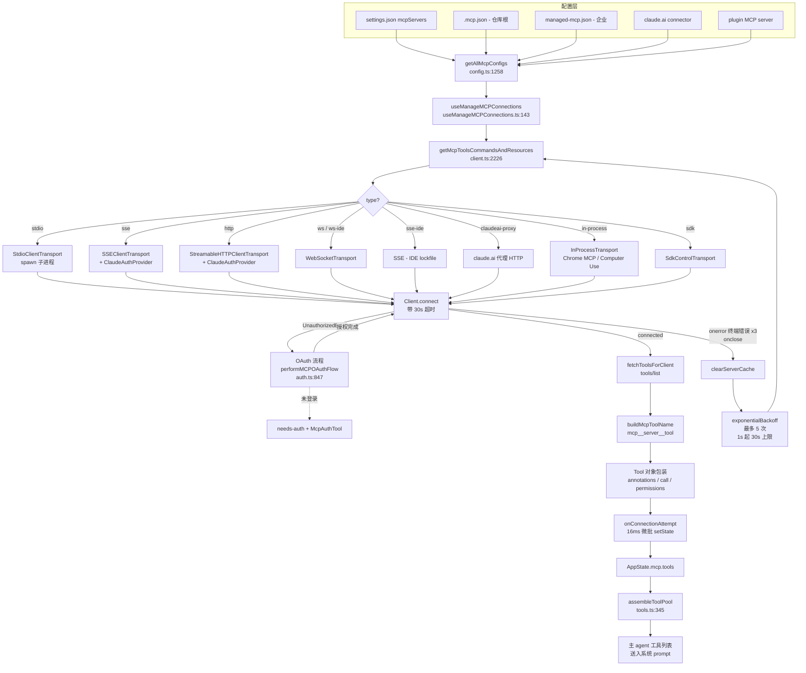

# 09 · MCP 集成（Model Context Protocol）

## 1. 模块作用

MCP（Model Context Protocol）是 Anthropic 推出的、给 LLM agent 接外部工具/资源的标准协议。`mycli` 通过 MCP 让用户把第三方工具（GitHub、Slack、自家服务器 …）以"server"形式挂到主 agent 的工具列表里。

`src/services/mcp/` 这一棵子树负责的事：

1. **读配置**：从 `~/.mycli/settings.json`、项目级 `.mycli/settings.local.json`、仓库根 `.mcp.json`、企业 `managed-mcp.json`、claude.ai 远程下发的 connector、以及插件提供的 server 多个来源汇总 MCP server 列表。
2. **建立连接**：根据 server `type`（`stdio` / `sse` / `http` / `ws` / `sse-ide` / `ws-ide` / `sdk` / `claudeai-proxy`）选择对应 transport 建立 `@modelcontextprotocol/sdk` 的 `Client`。
3. **OAuth 协商**：对支持 OAuth 的远程 server（Slack、GitHub 官方 connector 等）跑 PKCE 授权流程，token 存到密钥环。
4. **工具/命令/资源拉取**：连上之后调 `tools/list`、`prompts/list`、`resources/list`，再把工具按 `mcp__<server>__<tool>` 命名规范包装成主 agent 可识别的 `Tool` 对象。
5. **运行期生命周期**：监听 `list_changed` 通知刷新工具列表；断线指数退避重连；处理 elicitation 请求；接收 channel/permission 推送。

## 2. 关键文件与职责

| 文件 | 行数 | 职责 |
|------|------|------|
| `src/services/mcp/types.ts` | 258 | server 配置 zod schema、`MCPServerConnection` 联合类型（`connected` / `failed` / `needs-auth` / `pending` / `disabled`）、序列化类型 |
| `src/services/mcp/config.ts` | 1578 | 配置加载/合并/去重，`.mcp.json` 读写，allowlist/denylist policy，企业管控开关，claude.ai connector 与本地配置的去重合并 |
| `src/services/mcp/client.ts` | 3348 | 模块的核心；`connectToServer`、`fetchToolsForClient`、`fetchCommandsForClient`、`fetchResourcesForClient`、`getMcpToolsCommandsAndResources`、`callMCPTool*` 全在这；transport 选择与重连胶水 |
| `src/services/mcp/auth.ts` | 2465 | `ClaudeAuthProvider`（OAuth client provider 实现）、`performMCPOAuthFlow`（PKCE 流程）、token revoke、step-up scope 缓存 |
| `src/services/mcp/xaa.ts` / `xaaIdpLogin.ts` | 511 / 487 | XAA（Cross-App Access，SEP-990）的跨 server 复用 IdP 流程 |
| `src/services/mcp/useManageMCPConnections.ts` | 1141 | React hook：把连接结果灌进 `AppState.mcp`、注册 `list_changed` / channel 通知 handler、自动指数退避重连、reconnect/toggle UI 接口 |
| `src/services/mcp/MCPConnectionManager.tsx` | 72 | 把 `useManageMCPConnections` 包成 React Context，向下游暴露 `useMcpReconnect()` / `useMcpToggleEnabled()` |
| `src/services/mcp/mcpStringUtils.ts` | 106 | `mcp__<server>__<tool>` 命名规范解析与构造（`buildMcpToolName` / `mcpInfoFromString` / `getMcpPrefix`）|
| `src/services/mcp/normalization.ts` | 23 | 把 server/tool 名规范化成只含 `[a-zA-Z0-9_-]` 的 token |
| `src/services/mcp/InProcessTransport.ts` | 63 | 同进程 client/server 配对 transport（给 Chrome MCP / Computer Use 这种"省一个进程"的 server 用）|
| `src/services/mcp/SdkControlTransport.ts` | 136 | SDK 控制通道（`type: 'sdk'` server）的 transport |
| `src/services/mcp/elicitationHandler.ts` | 313 | 处理 server 发起的 `elicitation/create` 请求，把 prompt 弹给用户 |
| `src/services/mcp/headersHelper.ts` | 138 | 配置项里的 `headersHelper`（外部脚本生成 header）执行 |
| `src/services/mcp/envExpansion.ts` | 38 | server 配置里的 `${VAR}` 变量展开 |
| `src/services/mcp/oauthPort.ts` | 78 | OAuth 回调本地监听端口分配（无 `callbackPort` 配置时随机找空闲口）|
| `src/services/mcp/officialRegistry.ts` | 72 | 官方 connector registry 元数据 |
| `src/services/mcp/channelNotification.ts` / `channelPermissions.ts` / `channelAllowlist.ts` | 316 / 240 / 76 | KAIROS 频道功能：server 通过 `notifications/claude/channel` 推送消息进 message queue |
| `src/services/mcp/mycliai.ts` | 164 | 拉取 claude.ai 上用户授权过的 MCP connector |
| `src/services/mcp/vscodeSdkMcp.ts` | 112 | VSCode 扩展场景下的 SDK MCP wiring |

## 3. 执行步骤（带 file:line 引用）

启动时 MCP 子系统的执行顺序：

1. **配置汇总**。`getAllMcpConfigs()` (`src/services/mcp/config.ts:1258`) 同时拉本地 `claude code` 配置（settings + `.mcp.json` + 企业 + 插件）和 claude.ai connector，再做去重合并，返回带 `scope` 标签的 `Record<string, ScopedMcpServerConfig>`。
2. **触发批量连接**。React 树渲染 `MCPConnectionManager` (`src/services/mcp/MCPConnectionManager.tsx:38`)，hook `useManageMCPConnections` (`src/services/mcp/useManageMCPConnections.ts:143`) 调用 `getMcpToolsCommandsAndResources` (`src/services/mcp/client.ts:2226`)。
3. **分类并发**。`getMcpToolsCommandsAndResources` 把 server 切成本地（`stdio` / `sdk`，并发低）和远程（`sse` / `http` / `ws` / `claudeai-proxy`，并发高）两组分别跑 (`src/services/mcp/client.ts:2266-2402`)。
4. **建立连接**。`connectToServer` (`src/services/mcp/client.ts:595`) 根据 `serverRef.type` 走不同分支：
   - `sse`：`SSEClientTransport` + `ClaudeAuthProvider` (`src/services/mcp/client.ts:619-677`)
   - `sse-ide` / `ws-ide`：内网 IDE 扩展专用，走的是 lockfile 写入的 URL，不带 OAuth (`src/services/mcp/client.ts:678-734`)
   - `ws`：`WebSocketTransport` (`src/services/mcp/client.ts:735-783`)
   - `http`：`StreamableHTTPClientTransport` + `ClaudeAuthProvider` (`src/services/mcp/client.ts:784-865`)
   - `claudeai-proxy`：通过 claude.ai 代理路由的 streamable HTTP (`src/services/mcp/client.ts:868-904`)
   - in-process（Chrome MCP / Computer Use）：`createLinkedTransportPair()` (`src/services/mcp/client.ts:905-943`)
   - `stdio`（默认 fallback）：`StdioClientTransport` 启子进程，`stderr: 'pipe'` 防止污染 UI (`src/services/mcp/client.ts:944-958`)
5. **MCP handshake**。`new Client(...).connect(transport)` (`src/services/mcp/client.ts:985-1048`)；带连接超时（`getConnectionTimeoutMs()`）；超时或失败时关闭 transport 并抛 `TelemetrySafeError`。HTTP 带 `Authorization: Bearer <session_ingress_token>`，但若有 OAuth token 优先用 OAuth (`src/services/mcp/client.ts:807-840`)。
6. **OAuth 401 fallback**。如果 connect 时抛 `UnauthorizedError`，进入 `handleRemoteAuthFailure`，把状态返回 `needs-auth` 并暴露 `McpAuthTool` 给主 agent（让模型/用户决定是否登录）(`src/services/mcp/client.ts:1105-1146`)。
7. **绑定生命周期 handler**：
   - `client.onerror`：识别 `ECONNRESET` / `ETIMEDOUT` 等终端错误，连续 3 次后主动 `client.close()` 触发上层重连 (`src/services/mcp/client.ts:1266-1371`)
   - `client.onclose`：清 `connectToServer.cache` 与 `fetchToolsForClient.cache`，下一次调用就会重连 (`src/services/mcp/client.ts:1374-1394`)
   - 默认 `ElicitRequestSchema` handler 返回 `{action: 'cancel'}`，等 hook 把真正的 UI handler 覆盖上 (`src/services/mcp/client.ts:1191-1197`)
8. **拉取工具/命令/资源**。`fetchToolsForClient` (`src/services/mcp/client.ts:1743) 发 `tools/list` JSON-RPC 请求，逐项包装成 `Tool` 对象：
   - `name = buildMcpToolName(client.name, tool.name)` → `mcp__<server>__<tool>` (`src/services/mcp/client.ts:1768`，`src/services/mcp/mcpStringUtils.ts:50`)
   - 保留 `tool.annotations.readOnlyHint` / `destructiveHint` / `openWorldHint` 给 permission 系统判断
   - `call()` 方法走 `callMCPToolWithUrlElicitationRetry`，自动处理 session 过期重试和 elicitation
9. **写入 AppState**。`onConnectionAttempt` callback (`src/services/mcp/useManageMCPConnections.ts:310`) 把 `{client, tools, commands, resources}` 推给 `flushPendingUpdates`（16ms 微批，避免高频 setState）(`src/services/mcp/useManageMCPConnections.ts:216-291`)，最终落到 `AppState.mcp.tools`。
10. **合并到主工具池**。`assembleToolPool(permissionContext, mcpTools)` (`src/tools.ts:345`) 把内置工具和 MCP 工具按名字排序去重，built-in 在前，MCP 在后（保 prompt cache 稳定性）。
11. **运行期通知**。已连 server 收到 `tools/list_changed` / `prompts/list_changed` / `resources/list_changed` 时，hook 刷新对应缓存并 setState (`src/services/mcp/useManageMCPConnections.ts:618-700`)。
12. **断线重连**。`onclose` 触发后，hook 起 `reconnectWithBackoff` 循环：最多 5 次，初始 1s、上限 30s 指数退避；中途用户禁用该 server 则停 (`src/services/mcp/useManageMCPConnections.ts:371-468`)。`stdio` / `sdk` 不重连（subprocess 没了就是没了）。

## 4. 流程图（Mermaid）

## 5. 与其他模块的交互

- **`src/Tool.ts` / `src/tools.ts`**：MCP 工具实现 `Tool` 接口，`assembleToolPool` (`src/tools.ts:345`) 是合并入口；`getToolNameForPermissionCheck` (`src/services/mcp/mcpStringUtils.ts:60`) 负责把 MCP 工具的权限校验名归一到全限定名。
- **`src/state/AppState.ts`**：所有连接状态/工具/命令/资源都挂在 `AppState.mcp`；hook 通过 `useSetAppState` 推送批量更新。
- **`src/utils/messageQueueManager.ts`**：channel 通知（KAIROS 特性）用 `enqueue()` 把 server push 转成主 agent 的 prompt（`src/services/mcp/useManageMCPConnections.ts:507-532`）。
- **`src/utils/auth.ts`**：MCP OAuth token 存在和 claude.ai OAuth 共用的 secure storage；`checkAndRefreshOAuthTokenIfNeeded` 用于刷新 access_token。
- **`src/skills/mcpSkills.ts`**（feature flag `MCP_SKILLS`）：从 server 暴露的 `skill://` 资源里读 skill，挂进 skill 系统。
- **`src/tools/MCPTool/MCPTool.tsx`**：MCP 工具调用结果的 React 渲染层；`McpAuthTool` (`src/tools/McpAuthTool/`) 在 `needs-auth` 时占位。
- **`src/utils/mycliInChrome/mcpServer.js`** + **`@ant/claude-for-chrome-mcp`**：被 in-process transport 用来跑 Chrome MCP，避免再起一个 ~325 MB 的子进程 (`src/services/mcp/client.ts:909-924`)。
- **`src/services/api/`**：MCP server 工具产出的内容（图片、二进制 blob）会经 `transformResultContent` 持久化到 `mcpOutputStorage`，再透出给上层会话。

## 6. 关键学习要点

1. **type 字段决定一切**：同一份 connect 函数靠 `serverRef.type` switch 走 7+ 种 transport。`stdio` 不写 `type` 也能识别（向后兼容），但远程 server 必须显式声明 `type`。
2. **`mcp__<server>__<tool>` 是硬约定**：tool 名经过 `normalizeNameForMCP` 后拼前缀；权限规则、deny list、prompt cache 全靠这个字符串匹配。`mcpInfoFromString` 在 server 名含 `__` 时会拆错，这是已知限制 (`mcpStringUtils.ts:14-18`)。
3. **不可见的并发分组**：本地 server（spawn 子进程，CPU 密）和远程 server（网络 I/O 密）并发上限不同，由 `getMcpServerConnectionBatchSize` / `getRemoteMcpServerConnectionBatchSize` 分开调 (`client.ts:552-562`)。
4. **`onerror` 不等于 `onclose`**：MCP SDK 的 transport 在 SSE/HTTP 终端错误时只触发 `onerror`，不会触发 `onclose`。`client.ts:1227-1364` 手动数 3 次终端错就调 `client.close()`，把 hung 住的 `callTool()` Promise 拒掉。这是排查"为什么远程 MCP 工具调用永远不返回"时的关键代码。
5. **OAuth 401 缓存**：`isMcpAuthCached` (`client.ts:280`) 有 15min TTL，避免 print 模式每次都重跑发现+401 这一对网络往返 (`client.ts:2301-2322`)。
6. **OAuth 依然在**（与 mycli 的"settings.json only"原则不冲突）：项目内 Anthropic 主 API 的 OAuth 已被砍，但 **MCP server 自己的 OAuth 仍保留**——MCP server 的 OAuth 是 server-to-server 协议，不是 mycli 主认证；token 存在 `mcpOAuth` keychain slot，与主 API token 隔离。

## 7. 延伸阅读

- `MYCLI.md` 中的 "MCP" 段落（如有）。
- `@modelcontextprotocol/sdk` 文档（[modelcontextprotocol.io](https://modelcontextprotocol.io/)）：JSON-RPC 协议、`tools/list` / `prompts/list` / `resources/list` 报文格式、`elicitation/create` server-initiated 请求。
- 同套架构里的伴生模块：
  - `docs/architecture/04-tools-and-permissions.md`（MCP 工具如何走 permission gate）
  - `docs/architecture/10-tasks-and-bridge.md`（`MonitorMcpTask` 监听 MCP 事件 → 但当前是 stub）
- 配置示例：根目录 `.mcp.json`，settings 里的 `mcpServers` 字段（schema 见 `src/services/mcp/types.ts:124-135`）。
