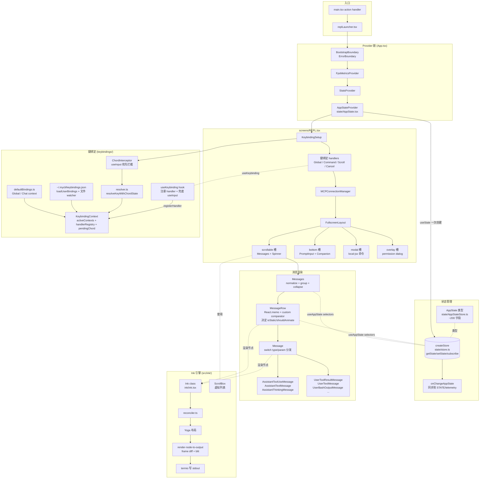

# TUI（Ink/React）

## 1. 模块作用

`mycli` 的所有交互界面都用 React + Ink 渲染到终端。但它**不直接依赖 npm 上游的 `ink`**：`src/ink/` 是一份自实现的 Ink，包含自己的 reconciler、Yoga 布局、render-to-screen pipeline、cursor/alt-screen 控制和事件系统。这一层之所以独立存在：

1. 上游 Ink 在巨型对话窗口（数千条消息）下重渲染太重，`src/ink/` 把"前后帧 diff + 局部 blit"做进了 `render-node-to-output.ts`，并提供 `<Static>`-like `OffscreenFreeze` 和虚拟列表 `<ScrollBox>`。
2. 需要原生 alt-screen / 鼠标滚轮 / 终端聚焦事件 / OSC 链接 / OSC 通知 / kitty keyboard protocol 等终端功能。
3. 设计系统层（`components/design-system/`）的 `ThemedBox` / `ThemedText` 替代裸 Box/Text，所有 render 入口被 `src/ink.ts` 包了一层 `ThemeProvider`。

模块的职责边界：**`src/ink/` 是渲染引擎**；**`src/components/` + `src/screens/` + `src/state/` + `src/keybindings/` 才是业务 UI**。文档主体覆盖业务侧，引擎只在第 5 节简述。

## 2. 关键文件与职责

| file_path | 职责 | 核心导出 |
|---|---|---|
| `src/ink.ts` | 业务侧统一 Ink 入口；包 `ThemeProvider`，re-export `Box/Text/useInput/useApp/measureElement` 等 | `render`、`createRoot`、`Box`、`Text`、`useInput`、`useTerminalSize` |
| `src/ink/ink.tsx` | `Ink` 类：管 stdin/stdout/stderr、创建 reconciler、调度 render、处理 ctrl+C/SIGINT、alt-screen 切换 | `default class Ink` |
| `src/ink/root.ts` | `createRoot()` / `render()` 包装；维护 `instances` map（按 stdout 复用） | `createRoot`、`default render` |
| `src/ink/components/ScrollBox.tsx` | 虚拟列表（按 viewport 切片渲染消息），REPL 主对话用它 | `default ScrollBox`、`ScrollBoxHandle` |
| `src/components/App.tsx` | 顶级 wrapper：`FpsMetricsProvider → StatsProvider → AppStateProvider → BootstrapBoundary` | `App` |
| `src/screens/REPL.tsx` | **主 REPL 画面**（约 5000 行）；组合 KeybindingSetup、各种 KeybindingHandlers、`MCPConnectionManager`、`FullscreenLayout`、`Messages`、`PromptInput`、permission dialog 队列、companion sprite 等 | `REPL`、`Props`、`Screen` |
| `src/screens/ResumeConversation.tsx` | `--resume` 选择器画面 | `ResumeConversation` |
| `src/screens/Doctor.tsx` | `mycli doctor` 健康检查画面 | — |
| `src/state/store.ts` | 11 行通用 store：`getState/setState/subscribe`，`Object.is` 跳过等值更新 | `createStore<T>` |
| `src/state/AppState.tsx` | `AppStateProvider` + `useAppState(selector)` hook，基于 `useSyncExternalStore` 订阅切片 | `AppStateProvider`、`useAppState`、`useSetAppState`、`AppStoreContext` |
| `src/state/AppStateStore.ts` | `AppState` 类型定义（约 200 个字段：settings、mainLoopModel、permission context、tasks、bridge state、speculation 等）+ `getDefaultAppState()` | `AppState`、`AppStateStore`、`getDefaultAppState`、`SpeculationState` |
| `src/state/onChangeAppState.ts` | `setState` 的 onChange 回调（写到 STATE 全局、telemetry、mailbox 副作用） | `onChangeAppState` |
| `src/keybindings/defaultBindings.ts` | 默认键位（`Global` / `Chat` 等 context 的 keystroke → action 映射） | `DEFAULT_BINDINGS` |
| `src/keybindings/loadUserBindings.ts` | 读取 `~/.mycli/keybindings.json`、合并 default、watch 文件热更新 | `loadKeybindingsSyncWithWarnings`、`subscribeToKeybindingChanges` |
| `src/keybindings/KeybindingContext.tsx` | `KeybindingProvider` + `useKeybindingContext`；维护 active context 集合、handler registry、pending chord | `KeybindingProvider`、`useRegisterKeybindingContext` |
| `src/keybindings/KeybindingProviderSetup.tsx` | `<KeybindingSetup>` 组合器，**内含 `ChordInterceptor`**：用一个 `useInput` 抢先拦截所有按键 → resolver → action → 调 registered handler | `KeybindingSetup` |
| `src/keybindings/useKeybinding.ts` | 业务侧 hook：`useKeybinding('chat:submit', handler, { context: 'Chat' })` | `useKeybinding`、`useKeybindings` |
| `src/keybindings/resolver.ts` | 给定 `input + Key + activeContexts + bindings + pendingChord`，返回 match / chord_started / chord_cancelled / no_match | `resolveKeyWithChordState`、`getBindingDisplayText` |
| `src/keybindings/match.ts` | Ink Key → 字符串名归一化 + 修饰键匹配 | `getKeyName` |
| `src/components/Messages.tsx` | 消息列表容器（normalize、grouping、collapse Read/Search、unseen divider） | `Messages` |
| `src/components/MessageRow.tsx` | 单条消息行；`React.memo` + 自定义 comparator；决定 isStatic / shouldAnimate；委托给 `<Message>` | `MessageRow`、`isMessageStreaming`、`allToolsResolved` |
| `src/components/Message.tsx` | `switch (message.type)` / `switch (param.type)` 分发到具体子组件（assistant text/thinking/tool_use；user text/tool_result/...） | `Message`、`areMessagePropsEqual` |
| `src/components/messages/AssistantToolUseMessage.tsx` | 模型发起的 tool_use 渲染（带 input 摘要、状态图标） | `AssistantToolUseMessage` |
| `src/components/messages/UserToolResultMessage/UserToolResultMessage.tsx` | tool_result 渲染：成功 / 错误 / rejected / canceled 各自一个文件（同目录） | `UserToolResultMessage` |
| `src/components/FullscreenLayout.tsx` | 全屏模式布局：scrollable 主区 + bottom 输入区 + overlay/modal 槽位 | `FullscreenLayout`、`UnseenDivider` |
| `src/components/MessageRow`/`messages/*` | 30+ 单一职责消息组件 | 各自具名导出 |

## 3. 执行步骤（带代码引用）

1. **挂载入口**：`replLauncher.tsx:12-21` 在 `main.tsx` action handler 末尾被调用，组装 `<App {...appProps}><REPL {...replProps}/></App>` 后通过 `renderAndRun(root, element)` 让 Ink root 渲染（`src/ink.ts:25-31`，内部 `inkCreateRoot` 来自 `src/ink/root.ts:129-157`，最终 `instance.render(node)` 走 `Ink.render` 即 `src/ink/ink.tsx:344` 附近）。
2. **Provider 三层**：`components/App.tsx:50-94` 由内向外 = `BootstrapBoundary → FpsMetricsProvider → StatsProvider → AppStateProvider`。`AppStateProvider`（`state/AppState.tsx:37-110`）：
   - `state/AppState.tsx:48-57` 用 `useState(() => createStore(initialState ?? getDefaultAppState(), onChangeAppState))` **只在挂载时建一次 store**；
   - `state/store.ts:10-34` `createStore` 是个 11 行的小观察者：`setState(updater)` 用 `Object.is` 比对，相等就 bail out；
   - `state/AppState.tsx:91` 调 `useSettingsChange(onSettingsChange)`，把磁盘 settings 变更同步进 AppState；
   - context 值（store 引用）一旦创建就稳定，**Provider 自身永不重渲染** —— 消费侧用 `useSyncExternalStore` 订阅切片。
3. **状态消费**：`state/AppState.tsx:142-163` `useAppState(selector)` 内部 `useSyncExternalStore(store.subscribe, get, get)`。注释强调"selector 不要返回新对象 —— Object.is 永远视为已变"。所以业务侧：
   ```
   const verbose = useAppState(s => s.verbose)
   const { text, promptId } = useAppState(s => s.promptSuggestion)
   ```
   `useSetAppState()` 拿 stable 的 setter；不订阅时纯写组件不重渲染。
4. **REPL 顶层结构**：进入 `src/screens/REPL.tsx` 后，函数体非常巨大（`screens/REPL.tsx:604` `export function REPL`，主 return 在 `screens/REPL.tsx:4607` 附近）。结构（去枝叶）：
   ```
   <KeybindingSetup>
     <AnimatedTerminalTitle .../>
     <GlobalKeybindingHandlers .../>
     <CommandKeybindingHandlers .../>
     <ScrollKeybindingHandler .../>
     <CancelRequestHandler .../>
     <MCPConnectionManager>
       <FullscreenLayout
         scrollable={
           <>
             <TeammateViewHeader/>
             <Messages .../>
             <SpinnerWithVerb .../>
             <PromptInputQueuedCommands/>
           </>
         }
         bottom={
           <>
             {permissionStickyFooter}
             <PromptInput .../>
             <CompanionSprite/>
           </>
         }
         modal={centeredModal}
         overlay={toolPermissionOverlay}
       />
     </MCPConnectionManager>
   </KeybindingSetup>
   ```
   注意 `screens/REPL.tsx:4612-4621` 的注释：`ScrollKeybindingHandler` 必须在 `CancelRequestHandler` 之前 mount，让 `ctrl+c` 在有选区时复制而不是取消任务。**这种"按 mount 顺序决定优先级"是 Ink useInput 的潜规则**。
5. **键绑定流水线**：`KeybindingProviderSetup.tsx:206` 渲染 `<ChordInterceptor>`，它在 `KeybindingProviderSetup.tsx:226-305` 用一次 `useInput(handleInput)` 抢在所有子组件之前接收按键 —— 因为 `useInput` 按注册顺序触发，provider 比 children 先 mount，所以总是它先看到 key。流程：
   1. 用户按键 → `Ink` 实例 stdin pipeline → 派发 `InputEvent`（`ink/events/input-event.ts`）→ 所有 `useInput` 订阅者依序收到。
   2. `ChordInterceptor.handleInput(input, key, event)` 调 `resolveKeyWithChordState(input, key, activeContexts, bindings, pendingChord)`（`keybindings/resolver.ts`）。
   3. 返回 `{ type: 'match', action }` → 在 handler registry 找有 active context 的 handler 调用并 `event.stopImmediatePropagation()`；返回 `chord_started` → `setPendingChord(...)`，1 秒（`CHORD_TIMEOUT_MS`）内等下一键。
   4. 业务侧 `useKeybinding('app:toggleTodos', handler, { context: 'Global' })`（`keybindings/useKeybinding.ts:33-95`）做两件事：注册 handler 到 context 的 registry（被 ChordInterceptor 调用）**+ 自己 useInput 兜底**（component-local match 路径）。
   5. Active context 由组件挂载时调 `useRegisterKeybindingContext('ThemePicker')`（`keybindings/KeybindingContext.tsx:215-242`）决定，更具体的 context 优先于 `Global`。
6. **消息渲染管线**：
   1. `screens/REPL.tsx` 把 `displayedMessages`（已 normalize、group、collapse 的数组）传给 `<Messages>`。
   2. `components/Messages.tsx` 顶部 `LogoHeader` 必须 memo（`components/Messages.tsx:55-76` 的注释强调：脏化它会让后续所有 MessageRow 的 blit 缓存失效，长会话下 150K+ 写/帧）。
   3. 列表内每条消息渲染 `<MessageRow>`（`components/MessageRow.tsx:382` `React.memo(MessageRowImpl, areMessageRowPropsEqual)`）。
   4. `MessageRow` 决定：是否 transcript 模式、是否 grouped/collapsed、`isStatic`（已 resolved 的工具用静态渲染，避免动画导致重渲染）、`shouldAnimate`，再交给 `<Message>` 真正分发（`components/Message.tsx:82-560`）。`Message.tsx:82` `switch (message.type)`：assistant / user / system / progress / grouped_tool_use / collapsed_read_search / ...；assistant 内 `Message.tsx:483 switch (param.type)`：`tool_use` → `<AssistantToolUseMessage>`、`text` → `<AssistantTextMessage>`、`thinking` → `<AssistantThinkingMessage>`...；user 内 `Message.tsx:374 switch (param.type)`：`tool_result` → `<UserToolResultMessage>`（再按 success/error/rejected/canceled 子分支）。
   5. **tool_result 怎么显示**：`UserToolResultMessage/` 目录下五个文件分担状态。Tool 自己的 React 组件来自 `src/components/messages/` 之外的 tool 自己实现（每个 Tool 在 `Tool.ts` 接口里返回 `renderResultForAssistant` / 各自的展示组件），由 `UserToolResultMessage.tsx` 调用 `findToolByName(tools, ...)` 取出。**此处实现复杂，建议直接读源码**。
7. **滚动与 alt-screen**：`<FullscreenLayout>` 的 `scrollable` 槽位最终是 `<ScrollBox>`（`src/ink/components/ScrollBox.tsx`）。它通过 `flexGrow` 填满 `<AlternateScreen>` 的高度（终端行数 - 1）。`screens/REPL.tsx:4602-4606` 的注释明确写到："`<AlternateScreen>` at the root: everything below is inside its `<Box height={rows}>`. ScrollBox flexGrow resolves against this Box."。鼠标滚轮、PgUp/PgDn 通过 `ScrollKeybindingHandler` 调 `scrollRef.current.scrollBy/scrollTo`，不触发 React 重渲染（**滚动期间 `state.ts:798-805` 的 `scrollDraining` 标志会阻止后台 interval 抢 CPU**）。
8. **Ink 引擎层**：`src/ink/ink.tsx:76` `class Ink` 在 ctor 里建 reconciler、Yoga style pool、stdin pipeline。`ink.tsx:344` 附近 `render(node)` 调度新一轮 frame；`ink.tsx:437-449` 调 `this.renderer({...})` 输出 frame，再用 termio 写到 stdout。**这一层在 restoration 中是从 source maps 重建的，注释里有大量 patch 说明，建议作为渲染引擎黑盒看待，需要时再深入**。

## 4. 流程图



## 5. 与其他模块的交互

- **上游**：`main.tsx` action handler（`launchRepl`）；`bootstrap/state.ts` 提供 cwd/sessionId/meter；`utils/settings/` 提供初始 settings；`commands.ts` + `tools.ts` 提供 commands / tools 数组作为 props 传入 REPL。
- **下游**：
  - `query.ts` / `QueryEngine.ts`：REPL 的 `onSubmit` 把用户消息推入 query 引擎；引擎流式回写消息到 AppState（实际通过 `appendMessages` 等 callback），触发 `<Messages>` 重渲染。
  - `services/mcp/`：`<MCPConnectionManager>` 管理 MCP 客户端连接；REPL 把 toolset 注入。
  - `tasks/`、`bridge/`、`skills/`：通过 AppState 字段（`tasks`、`replBridge*`）让侧边栏 / footer 反映状态。
  - `services/PromptSuggestion/`、`hooks/useScheduledTasks.ts`、`proactive/`：通过 feature flag 在 REPL 内可选挂载。
- **数据流**：
  - **写**：用户键入 → ChordInterceptor → action handler → `setAppState(prev => ...)` → store 通知订阅者；或直接 mutate `STATE.*`（全局副作用）。
  - **读**：组件 `useAppState(s => s.field)` → `useSyncExternalStore` → 当 selector 输出变才重渲染。
  - **磁盘 ↔ 内存**：`~/.mycli/keybindings.json` 和 `~/.mycli/settings.json` 都有 file watcher（`subscribeToKeybindingChanges` / `useSettingsChange`），变更后通过 store.setState 同步进 AppState，全程不重启。

## 6. 关键学习要点

1. **selector 风格的全局 store**：`createStore<T>` 11 行 + `useSyncExternalStore` + `useAppState(selector)` 是把 Redux/Zustand 概念精炼到极致的写法。值得抄走当 Ink/CLI 的全局态方案。注意"selector 别返回新对象"是 React 18 `useSyncExternalStore` 的硬约束。
2. **状态分两层**：可序列化、参与重渲染的进 `AppState`（store）；不参与渲染、计数器/cwd/sessionId 进 `bootstrap/state.ts STATE`。**两类状态分开**避免 React 上下文化所有东西，也让非 React 代码（query 引擎）能直接读全局。
3. **Provider 永不重渲染的技巧**：`AppStateProvider` 用 `useState(() => createStore(...))` 把 store 引用做成稳定值，consumer 全部走 `useSyncExternalStore`。这模式在大组件树里能省下大量 wasted render。
4. **键绑定的 priority + chord**：`activeContexts` 集合 + `Global` 兜底 + chord pending 状态 + 超时取消，是 VSCode/Emacs 风格键位系统的最小可用实现。`ChordInterceptor` 抢在所有子 `useInput` 前面这一招（依赖 mount 顺序）值得记住 —— 它把"全局拦截"和"组件局部 handler 注册"解耦。
5. **render 性能的边角**：`LogoHeader` 必须 memo、`MessageRow` 用 custom comparator + `React.memo`、tool 已 resolved 的消息走 `isStatic` 静态渲染、滚动期间 background interval bail out（`getIsScrollDraining`）—— 这些是大对话窗口下还能 60fps 的关键。学 agent UI 时这些都是经验点。

## 7. 延伸阅读

- 接下来看：`docs/architecture/02-agent-loop.md`（query.ts 怎么把 AppState.messages 推进，未写）、`docs/architecture/03-tools.md`（Tool.ts 接口与渲染契约，未写）。
- 相关源：
  - `src/ink/ink.tsx` + `src/ink/reconciler.ts` + `src/ink/render-node-to-output.ts`：Ink 引擎，需要时深入
  - `src/ink/components/ScrollBox.tsx`：虚拟列表实现
  - `src/components/FullscreenLayout.tsx`：scrollable / bottom / modal / overlay 四槽位布局
  - `src/components/Message.tsx`：所有消息类型的 switch 路由表
  - `src/components/messages/UserToolResultMessage/`：tool 结果状态机渲染
  - `src/keybindings/parser.ts` + `schema.ts` + `validate.ts`：keybindings.json 的解析与校验
  - `src/state/AppStateStore.ts`（前 200 行）：理解 AppState 字段全景
  - `src/state/onChangeAppState.ts` + `src/state/selectors.ts`：哪些字段变更触发什么副作用
  - `MYCLI.md` 仓库根的 TUI 章节：上游目录级 tour
